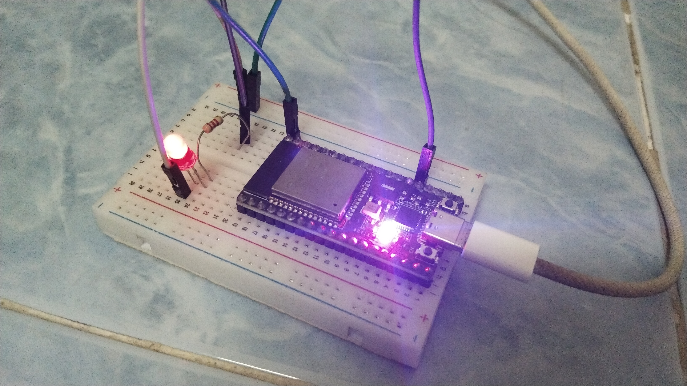
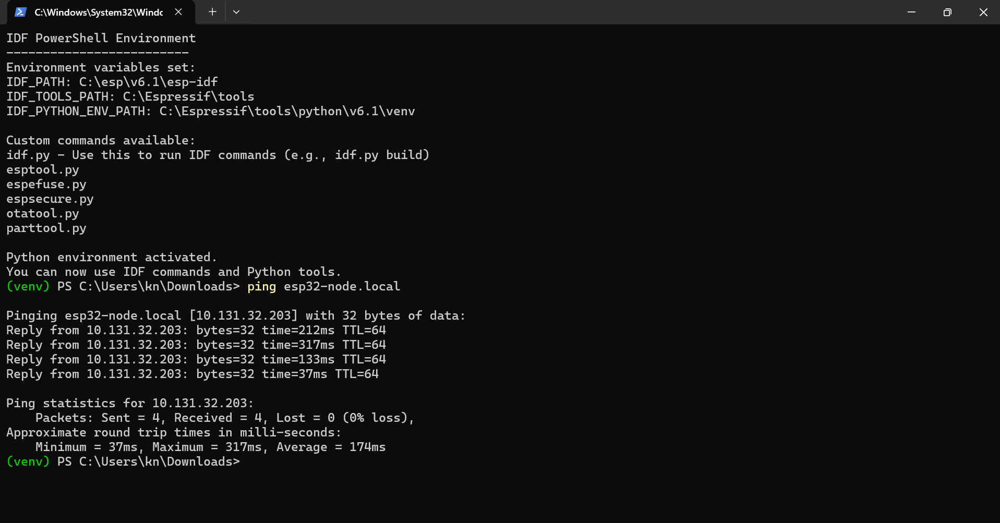
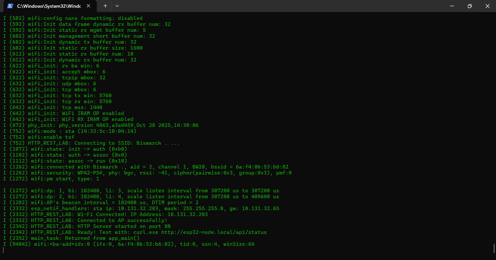
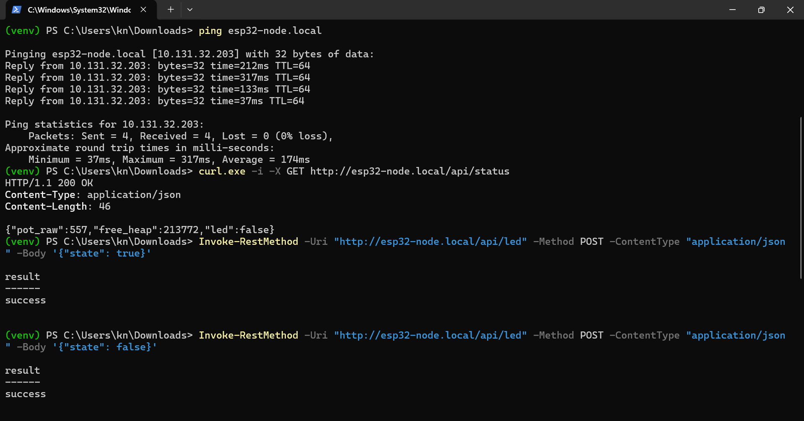

# แบบบันทึกผลการทดลองที่ 10.1
## mDNS Discovery และ HTTP RESTful API Server บน ESP-IDF

> อ้างอิงใบงาน: [06-Labsheet-10-1-mDNS-Discovery-and-HTTP-REST-Server.md](../06-Labsheet-10-1-mDNS-Discovery-and-HTTP-REST-Server.md)
> โค้ดโปรเจกต์: `Code/Lab10-1_HTTP_REST_Server/`

| รายการ | ข้อมูล |
| :--- | :--- |
| ชื่อ–นามสกุล | Theeranat Phutiwanich |
| รหัสนักศึกษา | 67030098 |
| วันที่ทำการทดลอง | 5 ตุลาคม 2569 |
| เวอร์ชัน ESP-IDF | v6.1 |
| รุ่นบอร์ดที่ใช้ | ESP32 DevKit (WROOM-32, USB-UART: Silicon Labs CP210x) |
| SSID เครือข่ายที่ทดสอบ | `Bismarck .` |
| IP Address ของ ESP32 | `10.131.32.203` |

**รูปการต่อวงจรจริง**



> ต่อ LED (ขั้วบวกผ่านตัวต้านทานจำกัดกระแส) เข้า GPIO 2 และขั้วลบเข้า GND — ภาพแสดง LED สีแดงติดสว่างขณะสั่งเปิดผ่าน `POST /api/led`

> [!NOTE] **หมายเหตุเรื่อง Potentiometer**
> ชุดทดลองจริงไม่มี Potentiometer 10k ต่อเข้า GPIO 34 จึงแก้ไขโค้ดในฟังก์ชัน `status_get_handler()` ให้ใช้ `esp_random() % 4096` สุ่มค่าแทนการอ่าน ADC จริง (ช่วง 0–4095 เท่ากับความละเอียด ADC 12-bit ของ ESP32 เพื่อให้ค่าสมจริงกับของจริง) ค่า `pot_raw` ที่บันทึกในรายงานนี้บางส่วนจึงเป็นค่าที่อ่านได้ก่อนปรับโค้ด (จาก ADC ลอยค้าง/floating pin) และบางส่วนเป็นค่าที่ได้จาก `esp_random()`

---

## ส่วนที่ 1 บันทึกผลการทดลอง (กิจกรรมที่ 10-1.5)

### 1.1 ผลการตรวจสอบ mDNS ด้วยคำสั่ง `ping esp32-node.local`

**คำสั่งที่ใช้**
```powershell
ping esp32-node.local
```

**ผลลัพธ์ที่ได้**



```text
Pinging esp32-node.local [10.131.32.203] with 32 bytes of data:
Reply from 10.131.32.203: bytes=32 time=212ms TTL=64
Reply from 10.131.32.203: bytes=32 time=317ms TTL=64
Reply from 10.131.32.203: bytes=32 time=133ms TTL=64
Reply from 10.131.32.203: bytes=32 time=37ms TTL=64

Ping statistics for 10.131.32.203:
    Packets: Sent = 4, Received = 4, Lost = 0 (0% loss),
Approximate round trip times in milli-seconds:
    Minimum = 37ms, Maximum = 317ms, Average = 174ms
```

| รายการ | ผลที่บันทึกได้ |
| :--- | :--- |
| ชื่อโฮสต์ที่ประกาศผ่าน mDNS | `esp32-node.local` |
| IP Address ที่ Resolve ได้ | `10.131.32.203` |
| Round-trip time เฉลี่ยจาก ping (ms) | 174 ms (Min 37 ms / Max 317 ms) |
| Packet Loss | 0% (4/4 สำเร็จ) |
| ต้องแก้ปัญหา Troubleshooting หรือไม่ (Private Network / ถอดสาย LAN) | ไม่ต้อง — mDNS ทำงานได้ทันทีโดยไม่ต้องปรับตั้งค่า Windows เพิ่มเติม |

**หลักฐานเพิ่มเติม — Log การบูตและเชื่อมต่อ Wi-Fi สำเร็จบนบอร์ด**



```text
I (752) HTTP_REST_LAB: Connecting to SSID: Bismarck . ...
I (1072) wifi:state: init -> auth (0xb0)
I (1102) wifi:state: auth -> assoc (0x0)
I (1112) wifi:state: assoc -> run (0x10)
I (1262) wifi:connected with Bismarck ., aid = 2, channel 1, BW20, bssid = 6a:f4:0b:53:b6:82
I (1262) wifi:security: WPA2-PSK, phy: bgn, rssi: -41, cipher(pairwise:0x3, group:0x3), pmf:0
I (2332) esp_netif_handlers: sta ip: 10.131.32.203, mask: 255.255.255.0, gw: 10.131.32.65
I (2332) HTTP_REST_LAB: Wi-Fi Connected! IP Address: 10.131.32.203
I (2332) HTTP_REST_LAB: Connected to AP successfully!
I (2342) HTTP_REST_LAB: HTTP Server started on port 80
I (2342) HTTP_REST_LAB: Ready! Test with: curl.exe http://esp32-node.local/api/status
```

> ค่า RSSI = -41 dBm (สัญญาณแรงมาก) เชื่อมต่อด้วย WPA2-PSK บน Channel 1 (คลื่น 2.4 GHz)

---

### 1.2 ผลการอ่านค่าเซนเซอร์ผ่าน `GET /api/status`

**คำสั่งที่ใช้**
```powershell
curl.exe -i -X GET http://esp32-node.local/api/status
```

**ผลลัพธ์แบบ verbose (`curl -i`) รวม HTTP Response Header**



```text
HTTP/1.1 200 OK
Content-Type: application/json
Content-Length: 46

{"pot_raw":557,"free_heap":213772,"led":false}
```

| รายการ | ผลที่บันทึกได้ |
| :--- | :--- |
| HTTP Status Code | `200 OK` |
| ค่า `pot_raw` ที่อ่านได้ | 557 |
| ค่า `free_heap` (ไบต์) | 213,772 ไบต์ (~208.8 KB) |
| ค่า `led` | `false` |

---

### 1.3 ผลการสั่งเปิด–ปิด LED ผ่าน `POST /api/led`

**คำสั่งที่ใช้ (PowerShell `Invoke-RestMethod`)**
```powershell
# สั่งเปิดไฟ LED (GPIO 2)
Invoke-RestMethod -Uri "http://esp32-node.local/api/led" -Method POST -ContentType "application/json" -Body '{"state": true}'

# สั่งปิดไฟ LED (GPIO 2)
Invoke-RestMethod -Uri "http://esp32-node.local/api/led" -Method POST -ContentType "application/json" -Body '{"state": false}'
```

| คำสั่งที่ส่ง | JSON Body | ข้อความตอบกลับ | สถานะ LED บนบอร์ด (ติด/ดับ) |
| :--- | :--- | :--- | :--- |
| `POST /api/led` (เปิด) | `{"state": true}` | `{"result":"success"}` | ติด (สีแดง) |
| `POST /api/led` (ปิด) | `{"state": false}` | `{"result":"success"}` | ดับ |

**บันทึกเพิ่มเติม / ปัญหาที่พบระหว่างทดลอง**
```text
1. ปัญหา Wi-Fi เชื่อมต่อไม่ติด (reason=201, NO_AP_FOUND) — สาเหตุคือพิมพ์ SSID ผิด
   ("Bismarch ." แทนที่จะเป็น "Bismarck .") แก้โดยสแกนเครือข่ายจริงด้วย
   `netsh wlan show networks mode=bssid` บนคอมพิวเตอร์เพื่อยืนยันชื่อ SSID ที่ถูกต้อง

2. ปัญหา LED ไม่ติดตอนต่อครั้งแรก — LED บนบอร์ดที่เห็นติดอยู่ตลอดเป็น Power Indicator LED
   (สีแดง) ไม่ได้ต่อกับ GPIO 2 จึงต้องต่อ LED ภายนอกเพิ่มเข้า Breadboard ผ่านตัวต้านทาน
   จำกัดกระแส 220-330 โอห์ม จาก GPIO 2 ไปยัง Anode และจาก Cathode ไปยัง GND
   หลังต่อใหม่และตรวจสอบขั้ว Anode/Cathode ให้ถูกต้อง LED จึงติด-ดับตามคำสั่งได้ปกติ

3. ไม่มี Potentiometer 10k ต่อจริง จึงแก้โค้ดให้ใช้ esp_random() % 4096 แทนการอ่าน ADC จริง
```

---

## ส่วนที่ 2 คำถามท้ายการทดลอง

### คำถามข้อ 1
**นำผลการรัน `curl -i` (โหมด verbose เพื่อดู HTTP Response Header) มาแปะในรายงาน พร้อมวิเคราะห์ว่า HTTP Header มีขนาดกี่ไบต์ และข้อมูล JSON มีขนาดกี่ไบต์**

**ผลการรัน `curl -i`**
```text
HTTP/1.1 200 OK
Content-Type: application/json
Content-Length: 46

{"pot_raw":557,"free_heap":213772,"led":false}
```

**ตารางวิเคราะห์ขนาดข้อมูล**

| ส่วนของข้อมูล | เนื้อหาที่นับ | ขนาด (ไบต์) |
| :--- | :--- | :---: |
| Status line | `HTTP/1.1 200 OK\r\n` | 17 |
| Header: Content-Type | `Content-Type: application/json\r\n` | 32 |
| Header: Content-Length | `Content-Length: 46\r\n` | 20 |
| บรรทัดว่างคั่น Header/Body | `\r\n` | 2 |
| **HTTP Response Header รวม** | | **71** |
| **JSON Payload (Response Body)** | `{"pot_raw":557,"free_heap":213772,"led":false}` | **46** |
| **ขนาดรวมทั้งหมด** | Header + Body | **117** |
| **สัดส่วน Payload ต่อข้อมูลรวม (%)** | 46 ÷ 117 × 100% | **≈ 39.3%** |

**คำอธิบายและวิเคราะห์**
```text
HTTP Response Header ของ esp_http_server มีขนาดเพียง 71 ไบต์ เพราะส่งแค่ 3 ส่วน
(Status line, Content-Type, Content-Length) โดยไม่มี header เสริมอย่าง Date หรือ Server
ซึ่งต่างจากเว็บเซิร์ฟเวอร์ทั่วไป (เช่น Nginx/Apache) ที่มักมี header มากกว่านี้มาก

เมื่อเทียบกับตัวเลขอ้างอิงในใบงาน 10.4 ที่ระบุ Header ~180-250 ไบต์ นั่นเป็นตัวเลขที่นับรวม
Request Header ฝั่ง Client ด้วย (User-Agent, Accept, Host ฯลฯ ที่ curl/เบราว์เซอร์ส่งมา)
แต่ในที่นี้นับเฉพาะ Response Header ฝั่ง ESP32 เท่านั้น จึงมีขนาดเล็กกว่ามาก

สัดส่วน Payload 39.3% ถือว่าค่อนข้างสูงเมื่อเทียบกับ HTTP ทั่วไป เพราะ embedded HTTP server
อย่าง esp_http_server ออกแบบมาให้ overhead ต่ำ ไม่ส่ง header ที่ไม่จำเป็นออกไป ทำให้ประหยัด
แบนด์วิดท์และพลังงานได้มากกว่าเว็บเซิร์ฟเวอร์มาตรฐานบนคอมพิวเตอร์ทั่วไป
```

---

### คำถามข้อ 2
**หากในเครือข่ายมีคอมพิวเตอร์ที่ไม่รองรับ mDNS หรือปิดกั้นพอร์ต UDP 5353 จะเกิดผลกระทบอย่างไร และแก้ไขได้อย่างไร?**

**ผลกระทบที่เกิดขึ้น**
```text
คอมพิวเตอร์เครื่องนั้นจะไม่สามารถ resolve ชื่อโฮสต์ "esp32-node.local" เป็น IP Address ได้
เพราะกลไก mDNS อาศัยการส่ง multicast query ไปที่ 224.0.0.251 พอร์ต UDP 5353 เพื่อถามหาใคร
เป็นเจ้าของชื่อนั้นในเครือข่าย ถ้า Firewall บล็อกพอร์ตนี้ หรือ OS/เครือข่ายไม่มี mDNS responder
(เช่น Windows ที่ตั้งเครือข่ายเป็น Public แทน Private) คำสั่ง ping/curl ที่เรียกผ่านชื่อ .local
จะได้ error "could not find host" หรือ "Name or service not known" แม้ ESP32 จะทำงานปกติ
และ Ping/HTTP ไปยัง IP Address ตรง ๆ ยังทำงานได้อยู่
```

**แนวทางการแก้ไข**
```text
1. เปลี่ยนสถานะเครือข่าย Wi-Fi บน Windows จาก Public เป็น Private Network
   (Settings > Network & internet > Wi-Fi > คลิกชื่อเครือข่าย > Private)
   เพราะ Public profile จะสั่ง Windows Firewall บล็อกการรับส่ง mDNS UDP 5353 โดยอัตโนมัติ

2. ติดตั้งซอฟต์แวร์ mDNS responder เพิ่มเติมบนเครื่องที่ไม่รองรับ เช่น Bonjour Print Services
   สำหรับ Windows รุ่นเก่า หรือ Avahi บน Linux

3. ถ้าแก้ปัญหา Firewall/mDNS ไม่ได้ ให้ใช้ IP Address ของ ESP32 โดยตรงแทนชื่อ .local
   (เช่น http://10.131.32.203/api/status) ซึ่งไม่ต้องพึ่งพา mDNS เลย

4. ถอดสาย LAN หรือปิดการ์ด Ethernet ชั่วคราวหากเครื่องต่อทั้ง LAN และ Wi-Fi พร้อมกัน
   เพราะ Windows จะจัดลำดับ Routing Metric ให้ LAN สูงกว่า ทำให้ multicast packet
   หลุดออกไปทาง LAN แทนที่จะเป็น Wi-Fi ที่ ESP32 เชื่อมต่ออยู่
```

---

### คำถามข้อ 3
**เหตุใดจึงต้องเรียกคำสั่ง `cJSON_Delete(root)` และ `cJSON_free(resp)` เสมอหลังจากประมวลผลเสร็จสิ้น?**

**คำตอบ**
```text
cJSON เป็นไลบรารีที่จัดสรรหน่วยความจำแบบ dynamic allocation (malloc) บน Heap ของระบบฝังตัว
ซึ่งมี RAM จำกัดมากเมื่อเทียบกับคอมพิวเตอร์ทั่วไป (ESP32 มี Heap ว่างเพียงหลักแสนไบต์)
หากไม่คืนหน่วยความจำที่จัดสรรไว้กลับคืนระบบ จะเกิด Memory Leak สะสมทุกครั้งที่มี HTTP
Request เข้ามา จนสุดท้าย Heap หมดและระบบ Crash หรือ Reboot โดยไม่คาดคิด

- cJSON_Delete(root): ใช้ลบ cJSON object tree ทั้งหมดที่สร้างด้วย cJSON_CreateObject()
  และฟังก์ชัน cJSON_Add*ToObject() ต่าง ๆ คืนหน่วยความจำของทุก node ในโครงสร้างกลับสู่ Heap

- cJSON_free(resp): ใช้คืนหน่วยความจำของสตริงที่ได้จาก cJSON_PrintUnformatted() ซึ่งเป็น
  บัฟเฟอร์ string แยกต่างหากที่ cJSON จัดสรรขึ้นมาใหม่ (ไม่ได้อยู่ใน root tree) จึงต้องเรียก
  คืนแยกจาก cJSON_Delete() เสมอ มิเช่นนั้น resp buffer จะรั่วไหลทุกครั้งที่มีการตอบ response

เนื่องจาก status_get_handler() และ led_post_handler() ถูกเรียกทุกครั้งที่มี HTTP Request
เข้ามา (ซึ่งอาจเกิดขึ้นนับร้อยนับพันครั้งระหว่างระบบทำงาน) การลืมคืนหน่วยความจำแม้เพียง
เล็กน้อยต่อ request จะสะสมจนทำให้ ESP32 หน่วยความจำหมดและค้าง/รีเซ็ตในที่สุด
```

---

## ส่วนที่ 3 สรุปผลการทดลอง

```text
การทดลองนี้สามารถพัฒนา HTTP RESTful API Server บน ESP32 ด้วย esp_http_server ร่วมกับ
mDNS Service Discovery ได้สำเร็จ โดยสามารถเข้าถึงอุปกรณ์ผ่านชื่อ esp32-node.local แทนการ
จำ IP Address ได้จริง (resolve ได้ถูกต้อง 0% packet loss)

Endpoint GET /api/status และ POST /api/led ทำงานได้ตามที่ออกแบบไว้ สามารถอ่านค่าสถานะ
ระบบ (free_heap, led) และสั่งเปิด-ปิด LED ผ่าน JSON payload ได้ถูกต้อง ยืนยันด้วยการสังเกต
สถานะ LED จริงบนบอร์ดที่เปลี่ยนตามคำสั่ง HTTP ที่ส่งไป

ปัญหาหลักที่พบระหว่างทดลองคือการพิมพ์ชื่อ SSID ผิด (Bismarch แทน Bismarck) ซึ่งแก้ไขได้
ด้วยการสแกนเครือข่าย Wi-Fi จริงด้วย netsh เพื่อยืนยันชื่อที่ถูกต้อง และ LED บนบอร์ดที่เห็น
ติดอยู่ตลอดเวลาเป็นเพียง Power Indicator ไม่ได้เชื่อมกับ GPIO ที่ควบคุมได้ ต้องต่อ LED แยก
ต่างหากเข้า GPIO 2 ผ่านตัวต้านทานจำกัดกระแสจึงจะทดสอบได้ถูกต้อง

HTTP Response Header ของ esp_http_server มีขนาดเล็กมาก (71 ไบต์) เพราะส่งเฉพาะ header
ที่จำเป็น ทำให้สัดส่วน Payload ต่อข้อมูลรวมสูงถึง ~39.3% ซึ่งมีประสิทธิภาพกว่าเว็บเซิร์ฟเวอร์
ทั่วไปมากสำหรับงาน embedded/IoT ที่ต้องประหยัดแบนด์วิดท์และพลังงาน
```
