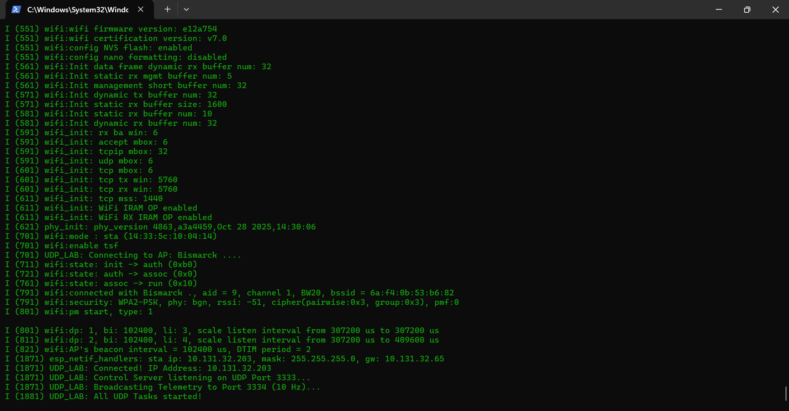
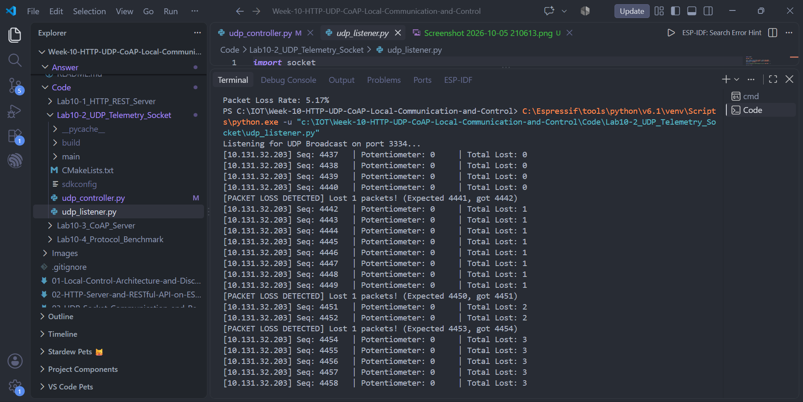
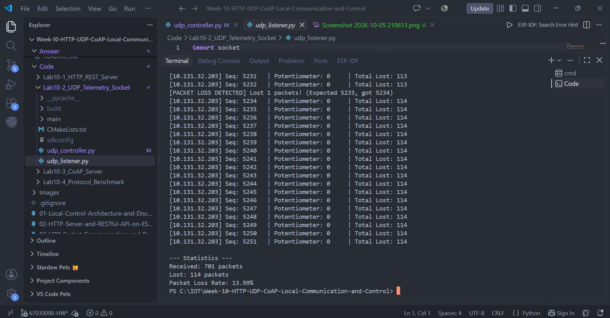
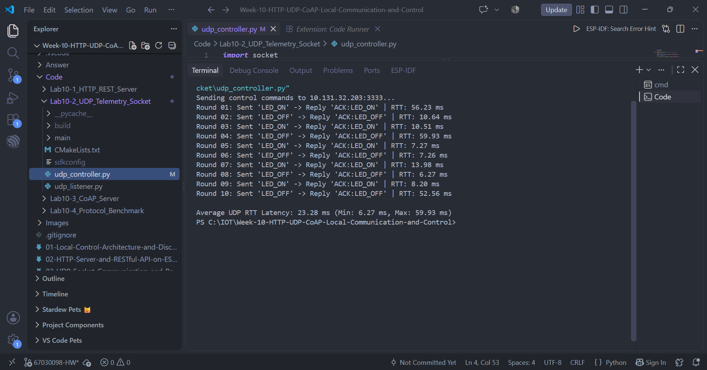
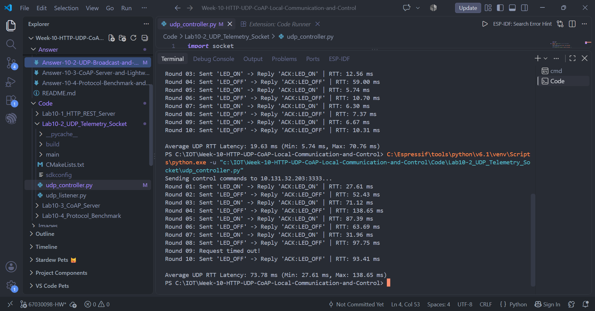

# แบบบันทึกผลการทดลองที่ 10.2
## การสื่อสารความหน่วงต่ำด้วย UDP Socket และ Real-time Telemetry Broadcast

> อ้างอิงใบงาน: [07-Labsheet-10-2-UDP-Broadcast-and-Realtime-Telemetry.md](../07-Labsheet-10-2-UDP-Broadcast-and-Realtime-Telemetry.md)
> โค้ดโปรเจกต์: `Code/Lab10-2_UDP_Telemetry_Socket/`

| รายการ | ข้อมูล |
| :--- | :--- |
| ชื่อ–นามสกุล | Theeranat Phutiwanich |
| รหัสนักศึกษา | 67030098 |
| วันที่ทำการทดลอง | 5 ตุลาคม 2569 |
| เวอร์ชัน ESP-IDF | v6.1 |
| SSID เครือข่ายที่ทดสอบ | `Bismarck .` |
| IP Address ของ ESP32 | `10.131.32.203` |
| พอร์ตรับคำสั่ง (Control) | 3333 |
| พอร์ตบรอดแคสต์ (Telemetry) | 3334 |
| อัตราการส่ง Telemetry ที่ตั้งไว้ (Hz) | 10 Hz (ส่งทุก 100 ms) |

**ผลการบูตและเชื่อมต่อ Wi-Fi ของ ESP32**



> ESP32 เชื่อมต่อ Wi-Fi `Bismarck .` สำเร็จ (RSSI −51 dBm, WPA2-PSK) ได้ IP `10.131.32.203` จากนั้นเริ่ม Control Server ที่พอร์ต UDP 3333 และ Telemetry Broadcast ที่พอร์ต 3334 (10 Hz) ครบถ้วน

> [!NOTE] **หมายเหตุเรื่อง Potentiometer**
> ตามที่บันทึกไว้ใน Lab 10.1 ชุดทดลองไม่มี Potentiometer ต่อเข้า GPIO 34 ค่า `POT` ที่ส่งใน Telemetry จึงเป็นค่าที่อ่านจาก ADC ขณะขาลอย (floating pin) ไม่ใช่ค่าที่หมุนปรับได้จริง

---

## ส่วนที่ 1 บันทึกผลการทดลอง (กิจกรรมที่ 10-2.5)

### 1.1 ผลการดักฟัง Telemetry Broadcast ด้วย `udp_listener.py`

> [!NOTE] **วิธีวัด**
> เดิมรัน `udp_listener.py` ไม่ได้รับข้อมูลเลย เพราะเครือข่าย Wi-Fi บน PC ตั้งเป็น Public ทำให้ Windows Firewall บล็อก UDP Broadcast ขาเข้า หลังเปลี่ยนเป็น Private จึงรับได้ มีการรัน 3 รอบ: **รอบ A** รันต่อเนื่อง 60 วินาที คำนวณ Received/Lost/Loss Rate จากไฟล์ผลลัพธ์ด้วยสูตรเดียวกับสคริปต์ (หยุดโปรแกรมด้วยสัญญาณ จึงไม่มีส่วน `--- Statistics ---`) และ **รอบ B** รันเองแล้วกด Ctrl+C ได้ส่วน `--- Statistics ---` ที่สคริปต์พิมพ์จริง แต่รอบนี้ SEQ เดินจาก 1684 ถึง 1954 (271 ค่า) ที่ 10 Hz คือรันประมาณ 27 วินาที ไม่ถึง 1 นาที และ **รอบ C** รันเองเช่นกัน มีรูปประกอบ SEQ เดินจาก 4437 ถึง 5251 (815 ค่า) คือรันประมาณ 81 วินาที นานกว่า 1 นาที ทั้งสามรอบใช้สูตรและข้อมูลชุดเดียวกัน

**ตัวอย่างข้อมูลที่ได้รับ** *(วางผลจาก Terminal 10–15 บรรทัดแรก และแนบรูปภาพ)*
```text
Listening for UDP Broadcast on port 3334...
[10.131.32.203] Seq: 3800   | Potentiometer: 0     | Total Lost: 0
[10.131.32.203] Seq: 3801   | Potentiometer: 0     | Total Lost: 0
[10.131.32.203] Seq: 3802   | Potentiometer: 0     | Total Lost: 0
...
[PACKET LOSS DETECTED] Lost 1 packets! (Expected 4391, got 4392)
[10.131.32.203] Seq: 4392   | Potentiometer: 0     | Total Lost: 77
```

**ผลรอบ B (สคริปต์พิมพ์สถิติเอง)**
```text
--- Statistics ---
Received: 257 packets
Lost: 14 packets
Packet Loss Rate: 5.17%
```
> ในรอบ B มีเหตุการณ์สูญหาย 14 ครั้ง ครั้งละ 1 แพ็กเก็ต (เช่น คาดว่า 1720 ได้ 1721, คาดว่า 1725 ได้ 1726) ช่วงที่หายถี่เป็นกลุ่ม (SEQ 1745–1782 หายเกือบทุก 3 แพ็กเก็ต) แล้วเงียบไปนาน (SEQ 1783–1884 ไม่หายเลย) แสดงว่าการสูญหายไม่สม่ำเสมอ ผันแปรตามสภาพเครือข่ายในช่วงนั้น

**ผลรอบ C (สคริปต์พิมพ์สถิติเอง พร้อมรูปประกอบ)**





```text
--- Statistics ---
Received: 701 packets
Lost: 114 packets
Packet Loss Rate: 13.99%
```
> รอบ C เกิดการสูญหายตั้งแต่ช่วงต้น (SEQ 4441 หายแล้ว) และกระจายเป็นเหตุการณ์ละ 1 หรือ 2 แพ็กเก็ตตลอดการรัน ช่วงที่ไม่หายยาวสุดคือ SEQ 4917–4958 (42 แพ็กเก็ตติดกัน) แล้วกลับมาหายถี่อีก

**สถิติเปรียบเทียบ 3 รอบ**

| รายการ | รอบ A (60 วินาที) | รอบ B (ประมาณ 27 วินาที) | รอบ C (ประมาณ 81 วินาที) |
| :--- | :---: | :---: | :---: |
| ที่มาของสถิติ | คำนวณจากไฟล์ผลลัพธ์ | สคริปต์พิมพ์เอง | สคริปต์พิมพ์เอง (มีรูป) |
| จำนวนแพ็กเก็ตที่รับได้ (Received) | 523 | 257 | 701 |
| จำนวนแพ็กเก็ตที่สูญหาย (Lost) | 77 | 14 | 114 |
| Packet Loss Rate (%) | 12.83 | 5.17 | 13.99 |
| จำนวนแพ็กเก็ตที่ควรได้รับ (ช่วง SEQ) | 600 | 271 | 815 |
| อัตราการรับจริงเฉลี่ย (packets/sec) | 8.72 | ประมาณ 9.5 | ประมาณ 8.6 |
| ค่า `SEQ` เริ่มต้น / สุดท้าย | 3800 / 4399 | 1684 / 1954 | 4437 / 5251 |
| ช่วงค่า `POT` (ต่ำสุด–สูงสุด) | 0 – 6 | 0 – 0 | 0 – 0 |

> `POT` เป็นค่าจาก ADC ขณะไม่มี Potentiometer ต่อ จึงเป็นค่าลอยใกล้ 0 ไม่ใช่ค่าที่หมุนปรับได้

---

### 1.2 ผลการวัด RTT Latency ด้วย `udp_controller.py`

**ผลลัพธ์ที่ได้**



```text
Sending control commands to 10.131.32.203:3333...
Round 01: Sent 'LED_ON' -> Reply 'ACK:LED_ON' | RTT: 56.23 ms
Round 02: Sent 'LED_OFF' -> Reply 'ACK:LED_OFF' | RTT: 10.64 ms
Round 03: Sent 'LED_ON' -> Reply 'ACK:LED_ON' | RTT: 10.51 ms
Round 04: Sent 'LED_OFF' -> Reply 'ACK:LED_OFF' | RTT: 59.93 ms
Round 05: Sent 'LED_ON' -> Reply 'ACK:LED_ON' | RTT: 7.27 ms
Round 06: Sent 'LED_OFF' -> Reply 'ACK:LED_OFF' | RTT: 7.26 ms
Round 07: Sent 'LED_ON' -> Reply 'ACK:LED_ON' | RTT: 13.98 ms
Round 08: Sent 'LED_OFF' -> Reply 'ACK:LED_OFF' | RTT: 6.27 ms
Round 09: Sent 'LED_ON' -> Reply 'ACK:LED_ON' | RTT: 8.20 ms
Round 10: Sent 'LED_OFF' -> Reply 'ACK:LED_OFF' | RTT: 52.56 ms

Average UDP RTT Latency: 23.28 ms (Min: 6.27 ms, Max: 59.93 ms)
```

**ตารางบันทึกค่า RTT รายรอบ**

| รอบที่ | คำสั่งที่ส่ง | ข้อความตอบกลับ | RTT (ms) |
| :---: | :--- | :--- | :---: |
| 01 | `LED_ON` | `ACK:LED_ON` | 56.23 |
| 02 | `LED_OFF` | `ACK:LED_OFF` | 10.64 |
| 03 | `LED_ON` | `ACK:LED_ON` | 10.51 |
| 04 | `LED_OFF` | `ACK:LED_OFF` | 59.93 |
| 05 | `LED_ON` | `ACK:LED_ON` | 7.27 |
| 06 | `LED_OFF` | `ACK:LED_OFF` | 7.26 |
| 07 | `LED_ON` | `ACK:LED_ON` | 13.98 |
| 08 | `LED_OFF` | `ACK:LED_OFF` | 6.27 |
| 09 | `LED_ON` | `ACK:LED_ON` | 8.20 |
| 10 | `LED_OFF` | `ACK:LED_OFF` | 52.56 |

**สรุปค่าสถิติ**

| รายการ | ค่าที่วัดได้ (ms) |
| :--- | :---: |
| Min RTT | 6.27 |
| Mean RTT (เฉลี่ย) | 23.28 |
| Max RTT | 59.93 |
| Jitter (Max − Min) | 53.66 |
| จำนวนรอบที่ Timeout | 0 (ได้ ACK ครบ 10/10) |

**การวัดซ้ำครั้งที่ 2** *(รันหลังบอร์ดหลุดจากเครือข่ายชั่วคราวและกลับมาออนไลน์ ที่ IP เดิม `10.131.32.203`)*



> รูปนี้ยังแสดงผลอีกรอบหนึ่งอยู่ส่วนบน (เฉลี่ย 19.63 ms, Min 5.74 ms, Max 70.76 ms) ซึ่งเห็นไม่ครบทุกรอบ จึงไม่นำมาคำนวณในตารางสรุป

```text
Round 01: Sent 'LED_ON' -> Reply 'ACK:LED_ON' | RTT: 27.61 ms
Round 02: Sent 'LED_OFF' -> Reply 'ACK:LED_OFF' | RTT: 52.43 ms
Round 03: Sent 'LED_ON' -> Reply 'ACK:LED_ON' | RTT: 71.12 ms
Round 04: Sent 'LED_OFF' -> Reply 'ACK:LED_OFF' | RTT: 138.65 ms
Round 05: Sent 'LED_ON' -> Reply 'ACK:LED_ON' | RTT: 87.39 ms
Round 06: Sent 'LED_OFF' -> Reply 'ACK:LED_OFF' | RTT: 63.69 ms
Round 07: Sent 'LED_ON' -> Reply 'ACK:LED_ON' | RTT: 31.96 ms
Round 08: Sent 'LED_OFF' -> Reply 'ACK:LED_OFF' | RTT: 97.75 ms
Round 09: Request timed out!
Round 10: Sent 'LED_OFF' -> Reply 'ACK:LED_OFF' | RTT: 93.41 ms

Average UDP RTT Latency: 73.78 ms (Min: 27.61 ms, Max: 138.65 ms)
```

**การวัดซ้ำครั้งที่ 3**

```text
Round 01: Sent 'LED_ON' -> Reply 'ACK:LED_ON' | RTT: 41.79 ms
Round 02: Sent 'LED_OFF' -> Reply 'ACK:LED_OFF' | RTT: 7.71 ms
Round 03: Sent 'LED_ON' -> Reply 'ACK:LED_ON' | RTT: 7.63 ms
Round 04: Sent 'LED_OFF' -> Reply 'ACK:LED_OFF' | RTT: 11.26 ms
Round 05: Sent 'LED_ON' -> Reply 'ACK:LED_ON' | RTT: 10.87 ms
Round 06: Sent 'LED_OFF' -> Reply 'ACK:LED_OFF' | RTT: 8.02 ms
Round 07: Sent 'LED_ON' -> Reply 'ACK:LED_ON' | RTT: 55.93 ms
Round 08: Sent 'LED_OFF' -> Reply 'ACK:LED_OFF' | RTT: 5.75 ms
Round 09: Sent 'LED_ON' -> Reply 'ACK:LED_ON' | RTT: 10.45 ms
Round 10: Sent 'LED_OFF' -> Reply 'ACK:LED_OFF' | RTT: 6.56 ms

Average UDP RTT Latency: 16.60 ms (Min: 5.75 ms, Max: 55.93 ms)
```

**การวัดซ้ำครั้งที่ 4** *(หลังแฟลช Firmware Lab 2 กลับลงบอร์ดอีกครั้ง)*

```text
Round 01: Sent 'LED_ON' -> Reply 'ACK:LED_ON' | RTT: 21.27 ms
Round 02: Sent 'LED_OFF' -> Reply 'ACK:LED_OFF' | RTT: 10.33 ms
Round 03: Sent 'LED_ON' -> Reply 'ACK:LED_ON' | RTT: 50.46 ms
Round 04: Sent 'LED_OFF' -> Reply 'ACK:LED_OFF' | RTT: 6.93 ms
Round 05: Sent 'LED_ON' -> Reply 'ACK:LED_ON' | RTT: 5.92 ms
Round 06: Sent 'LED_OFF' -> Reply 'ACK:LED_OFF' | RTT: 18.74 ms
Round 07: Sent 'LED_ON' -> Reply 'ACK:LED_ON' | RTT: 7.47 ms
Round 08: Sent 'LED_OFF' -> Reply 'ACK:LED_OFF' | RTT: 11.08 ms
Round 09: Sent 'LED_ON' -> Reply 'ACK:LED_ON' | RTT: 45.98 ms
Round 10: Sent 'LED_OFF' -> Reply 'ACK:LED_OFF' | RTT: 12.24 ms

Average UDP RTT Latency: 19.04 ms (Min: 5.92 ms, Max: 50.46 ms)
```

**สรุปการวัดทั้ง 4 ครั้ง**

| รายการ | ครั้งที่ 1 (ตามรูป) | ครั้งที่ 2 | ครั้งที่ 3 | ครั้งที่ 4 |
| :--- | :---: | :---: | :---: | :---: |
| Min RTT (ms) | 6.27 | 27.61 | 5.75 | 5.92 |
| Mean RTT (ms) | 23.28 | 73.78 | 16.60 | 19.04 |
| Max RTT (ms) | 59.93 | 138.65 | 55.93 | 50.46 |
| Jitter (Max − Min) (ms) | 53.66 | 111.04 | 50.18 | 44.54 |
| จำนวนรอบที่ Timeout | 0/10 | 1/10 (รอบที่ 9) | 0/10 | 0/10 |

> ทั้ง 4 ครั้งต่างกัน (เฉลี่ย 16.60–73.78 ms) แสดงว่า RTT บน Wi-Fi ผันแปรตามสภาพเครือข่ายในขณะนั้น ครั้งที่ 1, 3 และ 4 มีรูปแบบคล้ายกัน คือส่วนใหญ่ต่ำกว่า 14 ms และมีบางรอบสูงถึง 40–60 ms ส่วนครั้งที่ 2 ช้ากว่าทั้งชุดและมี Timeout จึงรายงานทั้งสามค่า ตารางเปรียบเทียบในข้อ 1 อ้างอิงครั้งที่ 1 ซึ่งมีรูปประกอบ โดยควรอ่านร่วมกับความผันผวนนี้

**บันทึกเพิ่มเติม / ปัญหาที่พบระหว่างทดลอง**
```text
- การวัดครั้งที่ 1 ได้รับ ACK ครบทุกรอบ ไม่มี Timeout (Loss 0%)
- การวัดครั้งที่ 2 รอบที่ 9 เกิด Timeout: เป็นตัวอย่างจริงของ UDP ที่ไม่มีการส่งซ้ำ แพ็กเก็ตคำสั่ง
  หรือ ACK หายไปแล้วไม่ถูกส่งใหม่ (ผู้ส่งต้องจัดการ Retry เอง) ซึ่งตรงข้ามกับ TCP
- ระหว่างการทดลองบอร์ดเคยหลุดจากเครือข่ายชั่วคราว ทำให้ ping ไปยัง IP ของบอร์ดได้ "Destination host
  unreachable" และ udp_controller.py Timeout ทุกรอบ จนบอร์ดกลับมาออนไลน์
- RTT แบ่งเป็น 2 กลุ่มชัดเจน: กลุ่มเร็วประมาณ 6–14 ms (7 รอบ) และกลุ่มช้าประมาณ 52–60 ms
  (3 รอบ: รอบที่ 1, 4 และ 10) ทำให้ Jitter สูงแม้ค่าส่วนใหญ่ต่ำ
- สันนิษฐานว่ากลุ่มช้าเกิดจากโหมดประหยัดพลังงานของ Wi-Fi บน ESP32 (log แสดง "wifi:pm start,
  type: 1" คือ Modem-sleep และ DTIM period = 2) ทำให้วิทยุของบอร์ดหลับระหว่างรอบ Beacon และ
  ต้องรอตื่นก่อนจึงรับแพ็กเก็ตได้ ส่วนรอบแรกอาจมีค่าหน่วงเพิ่มจากการ ARP Resolve
- ไม่ได้ทดสอบยืนยันสมมติฐานนี้ (เช่น ปิด Power Save ด้วย esp_wifi_set_ps(WIFI_PS_NONE))
- ไม่ได้บันทึกสถานะ LED ด้วยรูปภาพ แต่คำสั่งทุกรอบได้ ACK ตรงกับคำสั่งที่ส่ง
```

---

## ส่วนที่ 2 คำถามท้ายการทดลอง

### คำถามข้อ 1
**นำผลการวัดค่า RTT Latency ของ UDP ในกิจกรรมที่ 10-2.5 มาเปรียบเทียบกับความหน่วงเวลาของ HTTP RESTful ในใบงาน 10.1 และวิเคราะห์ความแตกต่าง**

> [!NOTE] **วิธีวัด HTTP**
> แฟลช Firmware Lab 10.1 ลงบอร์ดตัวเดิม (IP เดิม `10.131.32.203`) แล้วรัน `benchmark_protocols.py -p http -t 10.131.32.203 -n 10` จำนวน 3 ชุด ชุดละ 10 รอบ (ส่ง `POST /api/led` สลับ true/false) ได้ Status 200 ครบ 30/30 รอบ ฝั่ง UDP ใช้ผลจาก `udp_controller.py` 3 ชุดด้านบน ค่า Jitter ในตารางนี้คือ Max − Min เพื่อให้เทียบกันได้ (ตัวสคริปต์ benchmark รายงาน Jitter เป็นส่วนเบี่ยงเบนมาตรฐาน ซึ่งของ HTTP คือ 347.10, 150.64 และ 341.41 ms ตามลำดับ)

**ตารางเปรียบเทียบ**

| โปรโตคอล | ชุดที่ | Min RTT (ms) | Mean RTT (ms) | Max RTT (ms) | Jitter (Max−Min) (ms) | Timeout |
| :--- | :---: | :---: | :---: | :---: | :---: | :---: |
| UDP Socket (พอร์ต 3333) | 1 | 6.27 | 23.28 | 59.93 | 53.66 | 0/10 |
| UDP Socket | 2 | 27.61 | 73.78 | 138.65 | 111.04 | 1/10 |
| UDP Socket | 3 | 5.75 | 16.60 | 55.93 | 50.18 | 0/10 |
| UDP Socket | 4 | 5.92 | 19.04 | 50.46 | 44.54 | 0/10 |
| HTTP REST (`POST /api/led`) | 1 | 76.06 | 300.94 | 1314.17 | 1238.11 | 0/10 |
| HTTP REST | 2 | 70.38 | 313.15 | 585.28 | 514.90 | 0/10 |
| HTTP REST | 3 | 70.36 | 272.06 | 1269.96 | 1199.60 | 0/10 |
| **เฉลี่ยของค่า Mean (UDP / HTTP)** | | | **33.18 / 295.38** | | | |
| **อัตราส่วน HTTP ÷ UDP** | | | **ประมาณ 8.9 เท่า** | | | |

> ตัวเลขค่าเฉลี่ยของ UDP และ HTTP คำนวณจากค่า Mean ของแต่ละชุดเฉลี่ยกัน (UDP 4 ชุด: (23.28+73.78+16.60+19.04)/4 = 33.18; HTTP 3 ชุด: (300.94+313.15+272.06)/3 = 295.38) ค่า UDP ชุดที่ 2 ซึ่งช้าผิดปกติดึงค่าเฉลี่ยขึ้น ถ้าเทียบเฉพาะชุดที่ดีที่สุดของแต่ละโปรโตคอลจะได้ UDP 16.60 ms เทียบกับ HTTP 272.06 ms (ประมาณ 16 เท่า) ทั้งนี้ UDP และ HTTP วัดคนละเวลาและเป็นสคริปต์คนละตัว (udp_controller.py เทียบกับ benchmark_protocols.py) จึงมีความไม่แน่นอนของสภาพ Wi-Fi รวมอยู่ด้วย

**วิเคราะห์ความแตกต่าง**

จากผลวัด HTTP ใช้เวลามากกว่า UDP อย่างชัดเจนในทุกชุดการวัด (ต่ำสุดของ HTTP ราว 70 ms ใกล้เคียงกับค่าสูงสุดของ UDP ในชุดที่ดี) การเปรียบเทียบเชิงโครงสร้างของโปรโตคอลที่อธิบายความต่างนี้มีดังนี้
```text
1. TCP 3-Way Handshake: HTTP ต้องสร้างการเชื่อมต่อ TCP ก่อนส่งคำสั่ง (SYN, SYN-ACK, ACK) ซึ่งใช้อย่างน้อย
   1 RTT เพิ่มก่อนข้อมูลแรกจะถูกส่ง ส่วน UDP เป็น Connectionless ส่งคำสั่งได้ทันที 1 แพ็กเก็ต
   ได้ 1 ACK กลับ (1 RTT พอดี)
2. ขนาด Header: HTTP POST มี Header ประมาณ 150–250 ไบต์ + JSON Body (`{"state": true}`) เทียบกับ
   UDP ที่ใช้ Header 8 ไบต์ + Payload 6 ไบต์ (`LED_ON`) จึงส่งข้อมูลน้อยกว่ามาก
3. การ Parse ข้อความ: HTTP ต้อง Parse Request Line/Header และ JSON ด้วย cJSON ซึ่งใช้ CPU และ Heap
   มากกว่า การใช้ strcmp() เทียบข้อความสั้นๆ ของ UDP
4. Connection teardown: HTTP ต้องปิดการเชื่อมต่อ (FIN/ACK) หรือจัดการ Keep-Alive ส่วน UDP ไม่มี
5. ผลที่วัดได้: HTTP มี RTT เฉลี่ยราว 272–313 ms เทียบกับ UDP ราว 17–74 ms และ HTTP มี Jitter สูง
   มาก (บางรอบพุ่งถึง 1.2–1.3 วินาที โดยเฉพาะรอบแรกๆ ของแต่ละชุด) ส่วน UDP ตอบกลับภายในไม่กี่
   สิบมิลลิวินาทีเป็นส่วนใหญ่ ความต่างนี้สอดคล้องกับข้อ 1–4: ทุกคำขอ HTTP ในสคริปต์ benchmark
   เปิดการเชื่อมต่อ TCP ใหม่ (urllib ไม่ได้ใช้ Connection ซ้ำ) จึงเสีย Handshake และ Teardown ทุกรอบ
   และบนบอร์ดต้องสร้าง Task/Socket ของ esp_http_server รับคำขอ ส่วน UDP ใช้เพียงแพ็กเก็ตเดียวไป
   และอีกหนึ่งกลับ
6. Wi-Fi Power Save (Modem-sleep) ของ ESP32 กระทบทั้งสองโปรโตคอลบนบอร์ดเดียวกัน จึงเป็นส่วนหนึ่ง
   ของ Jitter ที่เห็นในทั้งคู่ แต่ HTTP ต้องแลกเปลี่ยนแพ็กเก็ตหลายตัวต่อคำสั่ง (SYN, SYN-ACK, ACK,
   คำขอ, คำตอบ, FIN) แต่ละตัวมีโอกาสถูกหน่วงจากการหลับของวิทยุ ความหน่วงจึงสะสมมากกว่า UDP
7. ข้อควรระวัง: ไม่ได้ทดสอบการใช้ HTTP Keep-Alive จริง และวัดแต่ละโปรโตคอลคนละช่วงเวลา จึงเป็นการ
   เปรียบเทียบเชิงแนวโน้ม ไม่ใช่ค่าที่แม่นยำของโปรโตคอลล้วนๆ
```

---

### คำถามข้อ 2
**รันสคริปต์ `udp_listener.py` เป็นเวลา 1 นาที จงบันทึกค่าและคำนวณอัตราการสูญหายของแพ็กเก็ต (Packet Loss Rate) พร้อมวิเคราะห์สาเหตุที่ทำให้เกิดการสูญหายบนเครือข่าย Wi-Fi**

**การคำนวณ**

$$\text{Packet Loss Rate} = \frac{\text{Lost}}{\text{Received} + \text{Lost}} \times 100\%$$

| ตัวแปร | รอบ A (60 วินาที) | รอบ B (≈27 วินาที) | รอบ C (≈81 วินาที) |
| :--- | :---: | :---: | :---: |
| Received | 523 | 257 | 701 |
| Lost | 77 | 14 | 114 |
| **Packet Loss Rate (%)** | **12.83** (= 77 / (523 + 77) × 100) | **5.17** (= 14 / (257 + 14) × 100) | **13.99** (= 114 / (701 + 114) × 100) |

> รอบที่ตรงกับเงื่อนไข "1 นาที" ของโจทย์มากที่สุดคือรอบ A (60 วินาที) ส่วนรอบ B และ C ไม่ได้รันครบ 60 วินาทีพอดี จึงรายงานทั้งสามรอบพร้อมระยะเวลาที่แท้จริง

**วิเคราะห์สาเหตุการสูญหายบนเครือข่าย Wi-Fi**
```text
ผลจริง: รอบ A สูญหาย 77 จาก 600 แพ็กเก็ต (12.83%), รอบ B 14 จาก 271 (5.17%) และรอบ C 114 จาก 815
(13.99%) อัตราต่างกันมากระหว่างรอบ (5–14%) แสดงว่าการสูญหายบน Wi-Fi ผันแปรตามช่วงเวลา การสูญหายกระจายเป็นเหตุการณ์เล็กๆ ครั้งละ 1–2 แพ็กเก็ต
(ไม่ใช่หายติดกันเป็นช่วงยาว) ซึ่งเข้ากับสาเหตุประเภทสัญญาณ/การส่ง Broadcast บน Wi-Fi มากกว่าบอร์ดค้าง
สาเหตุที่ทำให้แพ็กเก็ต UDP สูญหายบน Wi-Fi:
1. UDP ไม่มีกลไกส่งซ้ำ: ไม่มี ACK/Retransmission เหมือน TCP แพ็กเก็ตที่หายจึงหายถาวร
2. Broadcast บน Wi-Fi ถูกส่งที่อัตราต่ำสุดและไม่มี ACK ระดับ MAC: Access Point ส่ง Broadcast/Multicast
   หลัง Beacon ตามรอบ DTIM ด้วย Basic Rate และไม่มีการส่งซ้ำระดับ MAC เหมือน Unicast จึงสูญหายง่ายกว่า
3. สัญญาณรบกวนและการชนกันของสัญญาณ (Interference/Collision) ใน Band 2.4 GHz ที่แออัด (บอร์ดใช้ช่อง 1)
4. Wi-Fi Power Save ของ ESP32 (Modem-sleep, DTIM = 2): ถ้า PC รับไม่ทัน หรือบอร์ดหลับ จังหวะส่งอาจหายหรือหน่วง
5. บัฟเฟอร์ล้นที่ LwIP ของ ESP32 หรือที่ Socket ของ PC เมื่อส่งถี่และประมวลผลไม่ทัน
6. สัญญาณอ่อน: RSSI ของบอร์ด −51 dBm ถือว่าดี จึงไม่น่าเป็นสาเหตุหลักในการทดลองนี้
```

---

### คำถามข้อ 3
**อธิบายข้อดีและข้อจำกัดของการใช้ `255.255.255.255` (UDP Broadcast) ในระบบ IoT และในสถานการณ์ใดที่ควรเปลี่ยนไปใช้ UDP Multicast หรือ Unicast แทน?**

**ข้อดีของ UDP Broadcast**
```text
- ไม่ต้องรู้ IP ของผู้รับ: ผู้ส่งไม่ต้องตั้งค่าปลายทาง ผู้รับทุกเครื่องใน Subnet เดียวกันรับได้ทันที
  เหมาะกับการค้นหาอุปกรณ์ (Discovery) และกระจายข้อมูลเซนเซอร์ให้หลายเครื่อง
- ผู้ส่งส่งเพียง 1 แพ็กเก็ตต่อรอบ ไม่ว่าจะมีผู้รับกี่เครื่อง (ประหยัดกว่าส่ง Unicast ทีละเครื่อง)
- เพิ่มผู้รับใหม่ได้โดยไม่ต้องแก้ Firmware
- ใช้งานง่าย โค้ดสั้น (ตั้ง SO_BROADCAST แล้ว sendto ไปที่ 255.255.255.255)
```

**ข้อจำกัดของ UDP Broadcast**
```text
- ข้ามเครือข่าย (Router) ไม่ได้: จำกัดอยู่ใน Subnet/Broadcast Domain เดียวกัน
- ทุกเครื่องใน Subnet ต้องประมวลผลแพ็กเก็ต แม้ไม่ต้องการ ทำให้สิ้นเปลืองแบนด์วิดท์และ CPU
  โดยเฉพาะอุปกรณ์ IoT ที่ทรัพยากรจำกัด
- บน Wi-Fi ส่งด้วยอัตราต่ำและไม่มีการส่งซ้ำระดับ MAC จึงเสียเปรียบด้านความน่าเชื่อถือ
- ไม่มีความปลอดภัย: ใครใน Subnet ก็ดักอ่านได้ ไม่มีการยืนยันตัวตนหรือเข้ารหัส
- ไม่มี ACK/Flow Control และผู้ส่งไม่รู้ว่ามีใครรับอยู่หรือไม่
- ถูก Firewall ของ OS บล็อกได้ง่าย (เช่น เครือข่ายแบบ Public บน Windows ตามที่พบในการทดลองนี้)
```

**ตารางสรุปสถานการณ์การเลือกใช้**

| รูปแบบการส่ง | ปลายทาง | สถานการณ์ที่ควรใช้ | เหตุผล |
| :--- | :--- | :--- | :--- |
| Broadcast (`255.255.255.255`) | ทุกเครื่องใน Subnet | ค้นหาอุปกรณ์ (Discovery), ประกาศสถานะง่ายๆ ในเครือข่ายเล็ก, ไม่ทราบ IP ผู้รับ | ง่าย ไม่ต้องตั้งค่าผู้รับ แต่ต้องยอมรับว่าทุกเครื่องได้รับ |
| Multicast (`224.0.0.x` / `239.x.x.x`) | เฉพาะกลุ่มที่เข้าร่วม (IGMP) | ส่ง Telemetry ให้ผู้รับหลายเครื่องที่ต้องการ, ระบบที่มีอุปกรณ์จำนวนมาก, ข้าม Subnet ได้เมื่อ Router รองรับ | เฉพาะเครื่องที่สมัครกลุ่มเท่านั้นที่ประมวลผล ลดภาระเครื่องอื่น และขยายขนาดได้ดีกว่า |
| Unicast (IP เฉพาะเครื่อง) | เครื่องเดียว | ส่งคำสั่งควบคุม (เช่น LED_ON ที่พอร์ต 3333), ข้อมูลที่ต้องการ ACK/ความน่าเชื่อถือสูง, ข้อมูลสำคัญ/ต้องเข้ารหัส | Wi-Fi ส่งซ้ำระดับ MAC ได้และใช้อัตราส่งสูงกว่า ควบคุมและตรวจสอบผู้รับได้ ปลอดภัยกว่า |

---

## ส่วนที่ 3 สรุปผลการทดลอง

```text
บอร์ด ESP32 ทำงานตามที่ออกแบบ: เชื่อมต่อ Wi-Fi ได้ IP 10.131.32.203 เปิด UDP Control Server
(พอร์ต 3333) และ Telemetry Broadcast (พอร์ต 3334, 10 Hz) พร้อมกันด้วย FreeRTOS 2 Task

ผลการวัด RTT ของคำสั่งควบคุมแบบ Unicast ครั้งที่ 1 ได้ ACK ครบ 10/10 รอบ (Loss 0%) ค่าเฉลี่ย
23.28 ms (Min 6.27 ms, Max 59.93 ms) โดยค่าส่วนใหญ่ต่ำกว่า 14 ms แต่มี 3 รอบที่สูงราว 52–60 ms
สันนิษฐานว่าเกิดจากโหมดประหยัดพลังงาน Wi-Fi ของ ESP32 ส่วนครั้งที่ 2 ได้ค่าเฉลี่ย 73.78 ms
(Min 27.61 ms, Max 138.65 ms) และ Timeout 1 รอบ ส่วนครั้งที่ 3 และ 4 ได้ค่าเฉลี่ย 16.60 ms และ 19.04 ms
ตามลำดับ ไม่มี Timeout แสดงว่า RTT บน Wi-Fi ผันแปรตามสภาพเครือข่ายและ UDP ไม่รับประกัน
การส่งถึง

การรับ Telemetry Broadcast ใช้ไม่ได้เมื่อเครือข่ายบน PC เป็น Public (Firewall บล็อก) หลังเปลี่ยน
เป็น Private รับได้ รอบ A (60 วินาที) ได้รับ 523 แพ็กเก็ต สูญหาย 77 แพ็กเก็ต คิดเป็น Packet Loss
Rate 12.83% (อัตรารับจริง 8.72 แพ็กเก็ต/วินาที จากที่ตั้งไว้ 10) รอบ B (ประมาณ 27 วินาที)
ได้รับ 257 สูญหาย 14 คิดเป็น 5.17% และรอบ C (ประมาณ 81 วินาที) ได้รับ 701 สูญหาย 114 คิดเป็น 13.99% โดยรวม Packet Loss ของ Broadcast อยู่ราว 5–14% สูงกว่าคำสั่งแบบ
Unicast ซึ่งแทบไม่สูญหาย (Timeout 1 ใน 30 รอบรวม) สอดคล้องกับที่ Broadcast บน Wi-Fi ไม่มีการส่งซ้ำ
ระดับ MAC

เปรียบเทียบกับ HTTP (Lab 10.1) ที่วัดบนบอร์ดเดียวกัน HTTP มี RTT เฉลี่ยราว 272–313 ms สูงกว่า UDP
ประมาณ 8–16 เท่า เนื่องจาก TCP Handshake/Teardown และ Header ที่ใหญ่กว่า

ส่วนที่ควรทำเพิ่ม: แนบรูปผล benchmark HTTP (ถ้าอาจารย์ต้องการหลักฐาน)
```
