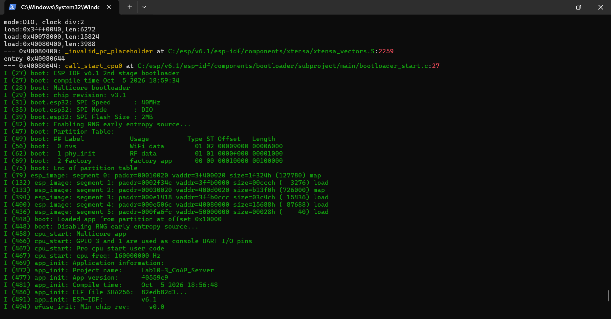
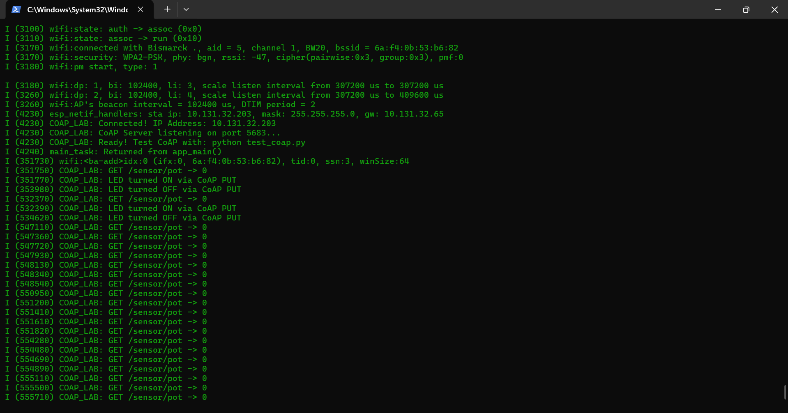
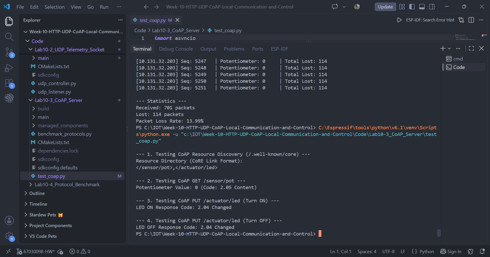

# แบบบันทึกผลการทดลองที่ 10.3
## CoAP Server สำหรับระบบฝังตัวและการควบคุมอุปกรณ์ด้วยโปรโตคอลน้ำหนักเบา

> อ้างอิงใบงาน: [08-Labsheet-10-3-CoAP-Server-and-Lightweight-IoT-Control.md](../08-Labsheet-10-3-CoAP-Server-and-Lightweight-IoT-Control.md)
> โค้ดโปรเจกต์: `Code/Lab10-3_CoAP_Server/`

| รายการ | ข้อมูล |
| :--- | :--- |
| ชื่อ–นามสกุล | Theeranat Phutiwanich |
| รหัสนักศึกษา | 67030098 |
| วันที่ทำการทดลอง | 5 ตุลาคม 2569 |
| เวอร์ชัน ESP-IDF | v6.1 |
| IP Address ของ ESP32 | `10.131.32.203` |
| พอร์ต CoAP | 5683 (UDP) |
| เวอร์ชันคอมโพเนนต์ `espressif/coap` | 4.3.5~8 (libcoap v4.3.x) |
| Stack Size ของ `coap_server_task` | 8192 ไบต์ |

**ผลการบูตของ ESP32 (ESP-IDF v6.1, โปรเจกต์ `Lab10-3_CoAP_Server`)**



**ผลการเชื่อมต่อ Wi-Fi และการรับคำขอ CoAP บน Serial Monitor**



> ESP32 เชื่อมต่อ Wi-Fi `Bismarck .` สำเร็จ (RSSI −47 dBm, WPA2-PSK) ได้ IP `10.131.32.203` จากนั้นเริ่ม CoAP Server ที่พอร์ต UDP 5683 และพิมพ์ log ทุกครั้งที่ได้รับ `GET /sensor/pot` (ค่า `0`) และ `PUT /actuator/led` (เปิด/ปิด)

---

## ส่วนที่ 1 บันทึกผลการทดลอง (กิจกรรมที่ 10-3.5)

### 1.1 ผลการทดสอบ Resource Discovery — `GET /.well-known/core`

**ผลลัพธ์ดิบที่ได้รับ (CoRE Link Format)**
```text
</sensor/pot>,</actuator/led>
```



**ตารางถอดความ Resource Directory** *(สำหรับตอบคำถามข้อ 1)*

| Resource URI | Attribute ที่ประกาศ (`rt=`, `if=`, `ct=` ฯลฯ) | ความหมาย |
| :--- | :--- | :--- |
| `/sensor/pot` | ไม่มี (โค้ดไม่ได้เพิ่ม attribute) | Resource อ่านค่า Potentiometer รองรับ GET |
| `/actuator/led` | ไม่มี (โค้ดไม่ได้เพิ่ม attribute) | Resource สั่งเปิด–ปิด LED รองรับ PUT |

---

### 1.2 ผลการอ่านค่าเซนเซอร์ — `GET /sensor/pot`

| รายการ | ผลที่บันทึกได้ |
| :--- | :--- |
| Response Code | `2.05 Content` |
| Payload ที่ได้รับ | `0` |
| ขนาด Payload (ไบต์) | 1 ไบต์ (ข้อความ `"0"`) |
| Content-Format (`ct`) | ไม่ระบุ (เซิร์ฟเวอร์ไม่ได้เพิ่ม Option นี้ ตีความเป็นข้อความธรรมดา) |

**ผลลัพธ์จาก Terminal**
```text
--- 2. Testing CoAP GET /sensor/pot ---
Potentiometer Value: 0 (Code: 2.05 Content)
```

> [!NOTE] **หมายเหตุเรื่อง Potentiometer**
> ค่าที่อ่านได้เป็น `0` ทุกครั้ง เช่นเดียวกับที่พบใน Lab 10.2 ซึ่งหมายความว่าขา GPIO 34 ไม่ได้รับแรงดันจากตัวต้านทานปรับค่า (ยังไม่ได้ต่อ Potentiometer หรือขากลางหลุด) ไม่ใช่ข้อผิดพลาดของโค้ด เพราะ CoAP ตอบ `2.05 Content` และส่ง Payload กลับถูกต้อง

---

### 1.3 ผลการสั่งเปิด–ปิด LED — `PUT /actuator/led`

| คำสั่งที่ส่ง | Payload | Response Code | สถานะ LED บนบอร์ด (ติด/ดับ) |
| :--- | :---: | :--- | :--- |
| `PUT /actuator/led` (เปิด) | `1` | `2.04 Changed` | ติด *(LED บน GPIO 2 ติด 2 วินาที)* |
| `PUT /actuator/led` (ปิด) | `0` | `2.04 Changed` | ดับ |

---

### 1.4 ผลการทดสอบ CON (Confirmable) เทียบกับ NON (Non-confirmable)

วัดด้วยสคริปต์ `aiocoap` ส่ง `GET /sensor/pot` ชนิดละ 20 ครั้ง (เว้นช่วง 100 ms, Timeout 5 วินาที) ในสภาพเครือข่ายปกติ

| รายการเปรียบเทียบ | CON (Confirmable) | NON (Non-confirmable) |
| :--- | :--- | :--- |
| Message Type ใน Header | `CON` (Type = 0) | `NON` (Type = 1) |
| มีการตอบ ACK กลับหรือไม่ | มี — เซิร์ฟเวอร์ตอบ `ACK` พร้อมข้อมูล `2.05 Content` ในแพ็กเก็ตเดียว (Piggybacked Response) | ไม่มี ACK — เซิร์ฟเวอร์ตอบเป็น `NON` พร้อมข้อมูลเลย |
| จำนวนแพ็กเก็ตต่อ 1 คำสั่ง | 2 (Request + Response แบบ ACK) | 2 (Request + Response) แต่ไม่มีการยืนยันการรับ |
| RTT เฉลี่ยที่วัดได้ (ms) | 344.60 (ต่ำสุด 39.53 / สูงสุด 2341.80) สำเร็จ 20/20 | 166.67 (ต่ำสุด 37.21 / สูงสุด 295.31) สำเร็จ 19/20 |
| ผลเมื่อทดสอบในสภาวะสัญญาณปกติ | ได้ครบทุกครั้ง | ได้ 19 จาก 20 ครั้ง (หายไป 1 ครั้ง) |
| ผลเมื่อทดสอบในสภาวะสัญญาณรบกวน/อ่อน | ไม่ได้ทดสอบแยก แต่ในการรันปกติพบรอบหนึ่งที่ RTT สูง 2341.80 ms ซึ่งสอดคล้องกับการส่งซ้ำ (Retransmission) แล้วจึงสำเร็จ | ไม่ได้ทดสอบแยก แต่พบ 1 ครั้งที่แพ็กเก็ตสูญหายและไม่ถูกส่งซ้ำ |
| พฤติกรรมการ Retransmission | ส่งซ้ำอัตโนมัติด้วย Exponential Backoff (Timeout เริ่มต้น 2–3 วินาที แล้วคูณ 2) สูงสุด 4 ครั้ง จนกว่าจะได้ ACK | ไม่ส่งซ้ำ ฝั่งแอปพลิเคชันต้องจัดการเอง |

**วิธีจำลองสัญญาณรบกวนที่ใช้**
```text
ไม่ได้จำลองสัญญาณรบกวนเพิ่มเติม ใช้เครือข่าย Wi-Fi จริง (SSID "Bismarck .",
RSSI ประมาณ -47 dBm) ในสภาวะปกติ ซึ่งมีการสูญหายของแพ็กเก็ตเกิดขึ้นเองบ้าง
(NON หาย 1 ครั้ง, CON มี 1 รอบที่ใช้เวลา 2341.80 ms เพราะถูกส่งซ้ำ)
ค่า RTT ที่วัดได้ไม่ใช่ค่าที่เสถียรนัก เนื่องจากบอร์ดเปิดโหมดประหยัดพลังงาน Wi-Fi (wifi:pm start)
จึงมีความหน่วงเพิ่มเป็นช่วง ๆ
```

---

### 1.5 ผลการทดสอบ CoAP Observe (RFC 7641)

ส่ง `GET /sensor/pot` พร้อม Observe Option = 0 (Register) แล้วรอ Notification 8 วินาที

| รายการ | ผลที่บันทึกได้ |
| :--- | :--- |
| Resource ที่ Observe | `/sensor/pot` |
| จำนวน Notification ที่ได้รับ | 0 — เซิร์ฟเวอร์ตอบ `2.05 Content` ครั้งแรกโดยไม่มี Observe Option และไม่ส่ง Notification ตามมา |
| เงื่อนไขที่ทำให้เกิด Notification | ไม่มี เพราะ Resource ไม่ได้ตั้งค่าเป็น Observable |
| ค่า Observe Option ที่เพิ่มขึ้นในแต่ละ Notification | ไม่มี (`None`) |

**ผลลัพธ์จาก Terminal**
```text
OBSERVE: first response code 2.05 Content observe option: None
no notification within 8s: StopAsyncIteration()
```

**บันทึกเพิ่มเติม / ปัญหาที่พบระหว่างทดลอง**
```text
1. เมื่อ Build ด้วย ESP-IDF v6.1 โดยใช้โฟลเดอร์ build/sdkconfig เดิมที่สร้างจาก v5.4.4
   เกิด Error "CONFIG_LWIP_IPV6_DUP_DETECT_ATTEMPTS undeclared" ที่ lwip
   แก้ไขโดยลบ build, managed_components, sdkconfig, dependencies.lock แล้ว
   รัน idf.py set-target esp32 และ idf.py build ใหม่ จึงผ่าน
2. โค้ดตามใบงานไม่ได้เปิดใช้ Observe (ไม่มี coap_resource_set_get_observable
   และ coap_resource_notify_observers) จึงทดสอบ Observe ไม่ได้ผลตามที่ใบงานคาดหวัง
   หากต้องการให้ใช้งานได้ ต้องเพิ่ม coap_resource_set_get_observable(r_pot, 1)
   ตอน ลงทะเบียน Resource และเรียก coap_resource_notify_observers() เป็นระยะ
3. ค่า Potentiometer เป็น 0 เพราะยังไม่ได้ต่อวงจรที่ GPIO 34
```

---

## ส่วนที่ 2 คำถามท้ายการทดลอง

### คำถามข้อ 1
**นำผลการ Query `/.well-known/core` มาแสดงในรายงาน พร้อมอธิบายรูปแบบ CoRE Link Format (RFC 6690) ว่าแสดงข้อมูลทรัพยากรอย่างไร**

**ผลการ Query**
```text
</sensor/pot>,</actuator/led>
```

**อธิบายรูปแบบ CoRE Link Format**
```text
CoRE Link Format (RFC 6690) เป็นรูปแบบข้อความสำหรับบอกรายการ Resource ที่อุปกรณ์มี
ดึงได้จาก URI มาตรฐาน /.well-known/core ใช้ Content-Format 40 (application/link-format)
โดยดัดแปลงมาจาก HTTP Link Header (RFC 8288) ให้กะทัดรัดสำหรับอุปกรณ์ที่มีทรัพยากรจำกัด

โครงสร้างของข้อมูล
  - แต่ละ Resource เขียนเป็น URI-Reference อยู่ในเครื่องหมาย < > เช่น </sensor/pot>
  - Resource หลายตัวคั่นด้วยเครื่องหมายจุลภาค (,)
  - ท้าย URI เพิ่ม Attribute ได้ โดยคั่นด้วยเครื่องหมายอัฒภาค (;) เช่น
        </sensor/pot>;rt="temperature";if="sensor";ct=0
    โดยที่ rt = Resource Type, if = Interface Description, ct = Content-Format,
    obs = รองรับ Observe, sz = ขนาดโดยประมาณ

ผลที่ได้จากบอร์ดคือ </sensor/pot>,</actuator/led> หมายถึงมี 2 Resource คือ
/sensor/pot และ /actuator/led ไม่มี Attribute เพราะโค้ดไม่ได้กำหนดเพิ่ม
(libcoap สร้างรายการนี้ให้เองโดยอัตโนมัติจาก Resource ที่ลงทะเบียน)

ประโยชน์คือไคลเอนต์ที่ไม่รู้จักอุปกรณ์มาก่อนสามารถค้นหาความสามารถได้เอง (Resource Discovery)
โดยไม่ต้องอ่านเอกสาร เหมาะกับระบบ M2M
```

---

### คำถามข้อ 2
**อธิบายความแตกต่างของแพ็กเก็ต CoAP ระหว่าง CON (Confirmable) และ NON (Non-confirmable) เมื่อทดสอบในเครือข่ายที่มีการรบกวนสัญญาณ**

**คำตอบ** *(อ้างอิงผลที่บันทึกในตารางข้อ 1.4)*
```text
ความต่างที่ Header: ฟิลด์ Type 2 บิตใน CoAP Header 4 ไบต์ CON = 0, NON = 1
(ACK = 2, RST = 3) ส่วนที่เหลือของแพ็กเก็ตเหมือนกัน

CON (Confirmable)
  - ผู้รับต้องตอบ ACK กลับ ถ้าผู้ส่งไม่ได้รับ ACK ภายใน Timeout
    จะส่งซ้ำด้วย Message ID เดิม (Exponential Backoff สูงสุด 4 ครั้ง)
  - ใช้ Message ID ให้ผู้รับตัดแพ็กเก็ตซ้ำได้
  - ข้อดี: ส่งถึงแน่นอนกว่า ข้อเสีย: ความหน่วงสูงขึ้นเมื่อมีการส่งซ้ำ
NON (Non-confirmable)
  - ส่งแล้วจบ ไม่มี ACK ไม่มีการส่งซ้ำ ภาระต่ำและหน่วงน้อย
  - ข้อดี: เหมาะกับข้อมูลที่ส่งถี่และค่าใหม่มาแทนค่าเก่าได้ เช่น ค่าเซนเซอร์
    ข้อเสีย: แพ็กเก็ตที่หายจะหายถาวร

ผลที่วัดได้ (20 ครั้งต่อชนิด)
  - CON สำเร็จ 20/20 แต่ RTT เฉลี่ย 344.60 ms และมีรอบที่ช้าถึง 2341.80 ms
    ซึ่งสอดคล้องกับการ Retransmission หลังแพ็กเก็ตหายหนึ่งครั้ง
  - NON สำเร็จ 19/20 (หาย 1 ครั้ง ไม่มีการกู้คืน) RTT เฉลี่ย 166.67 ms ต่ำกว่า CON
    เพราะไม่ต้องรอ Timeout

สรุป: เมื่อสัญญาณถูกรบกวน CON แลกความหน่วงกับความน่าเชื่อถือ ส่วน NON เร็วกว่า
แต่ยอมให้ข้อมูลสูญหาย ควรใช้ CON กับคำสั่งควบคุมสำคัญ เช่น เปิด–ปิด LED
และใช้ NON กับ Telemetry ที่ส่งซ้ำอยู่แล้ว
(หมายเหตุ: ตัวอย่างข้อมูลน้อยและเครือข่ายไม่ได้ถูกรบกวนจงใจ จึงเป็นแนวโน้ม ไม่ใช่ค่าที่แม่นยำทางสถิติ)
```

---

### คำถามข้อ 3
**ทำไม CoAP จึงเหมาะสมกับโปรโตคอลการสื่อสารบนเครือข่ายเช่น Thread, Zigbee IP หรือ NB-IoT มากกว่า HTTP?**

**คำตอบ** *(พิจารณาขนาด MTU ของ 6LoWPAN, พลังงานแบตเตอรี่, Radio Airtime, Header 4 ไบต์ เทียบกับ Plaintext Header ของ HTTP, และการไม่ต้องทำ TCP Handshake)*
```text
1. ขนาดแพ็กเก็ต/MTU: เครือข่าย 6LoWPAN บน IEEE 802.15.4 (Thread, Zigbee IP)
   มีเฟรมสูงสุด 127 ไบต์ เหลือพื้นที่ข้อมูลประมาณ 80–100 ไบต์ หลังหัว MAC/IPv6/UDP
   CoAP Header มีเพียง 4 ไบต์ ทำให้ทั้งข้อความอยู่ในเฟรมเดียวได้ ขณะที่ HTTP ใช้ Header
   เป็นข้อความธรรมดาหลายร้อยไบต์ (ดูผลวัดใน Lab 10.1) ต้องแตกเป็นหลายเฟรม
2. ไม่ต้องทำ TCP Handshake: CoAP ใช้ UDP ส่งคำขอได้ทันทีด้วย 1 แพ็กเก็ต
   ส่วน HTTP บน TCP ต้อง 3-way handshake ก่อน และต้องมี ACK/ปิดการเชื่อมต่อ
   จึงใช้แพ็กเก็ตมากกว่าหลายเท่า
3. พลังงานและ Radio Airtime: วิทยุเป็นส่วนที่กินพลังงานมากสุดของอุปกรณ์แบตเตอรี่
   ยิ่งส่งน้อยแพ็กเก็ตและสั้น วิทยุยิ่งเปิดน้อย อุปกรณ์หลับได้นานขึ้น
   ใน NB-IoT ที่คิดค่าบริการและจำกัดข้อมูลต่อวัน ข้อมูลที่เล็กลงช่วยประหยัดทั้งพลังงานและค่าใช้จ่าย
4. ความน่าเชื่อถือแบบเลือกได้: CoAP มีชนิด CON/NON ให้เลือกตามความสำคัญของข้อมูล
   และมี Observe ให้เซิร์ฟเวอร์ส่งข้อมูลเมื่อมีการเปลี่ยนแปลง แทนการ Polling ซ้ำ ๆ
5. เข้ากับ HTTP ได้: ใช้โมเดล REST (GET/PUT/POST/DELETE และรหัสตอบกลับคล้าย HTTP)
   จึงแปลงผ่าน HTTP–CoAP Proxy ได้ง่าย
```

---

## ส่วนที่ 3 สรุปผลการทดลอง

```text
ESP32 เชื่อมต่อ Wi-Fi ได้ IP 10.131.32.203 และรัน CoAP Server ที่พอร์ต UDP 5683 สำเร็จ
(Build ด้วย ESP-IDF v6.1, espressif/coap 4.3.5~8) ทดสอบด้วยสคริปต์ aiocoap ผ่านครบ 4 ขั้นตอน:
  1) Discovery ได้ </sensor/pot>,</actuator/led>
  2) GET /sensor/pot ได้ 2.05 Content (ค่า 0 เพราะยังไม่ได้ต่อ Potentiometer ที่ GPIO 34)
  3-4) PUT /actuator/led ค่า 1 และ 0 ได้ 2.04 Changed และ LED ติด/ดับตามคำสั่ง

เปรียบเทียบ CON กับ NON พบว่า CON เชื่อถือได้กว่า (20/20) แต่ RTT เฉลี่ยสูงกว่า (344.60 ms
เทียบกับ 166.67 ms) เพราะมีการส่งซ้ำเมื่อแพ็กเก็ตหาย ขณะที่ NON หายไป 1 จาก 20 ครั้ง
ส่วน CoAP Observe ทดสอบไม่สำเร็จ เนื่องจากโค้ดตามใบงานไม่ได้เปิด Resource ให้ Observe ได้
ต้องเพิ่ม coap_resource_set_get_observable() และ coap_resource_notify_observers() หากต้องการใช้งาน

ข้อสรุปคือ CoAP มี Header เล็ก (4 ไบต์) ใช้ UDP ไม่ต้องทำ Handshake และเลือก CON/NON ได้
จึงเหมาะกับอุปกรณ์ IoT ที่จำกัดพลังงานและแบนด์วิดท์มากกว่า HTTP
```
