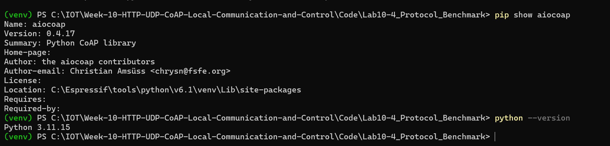
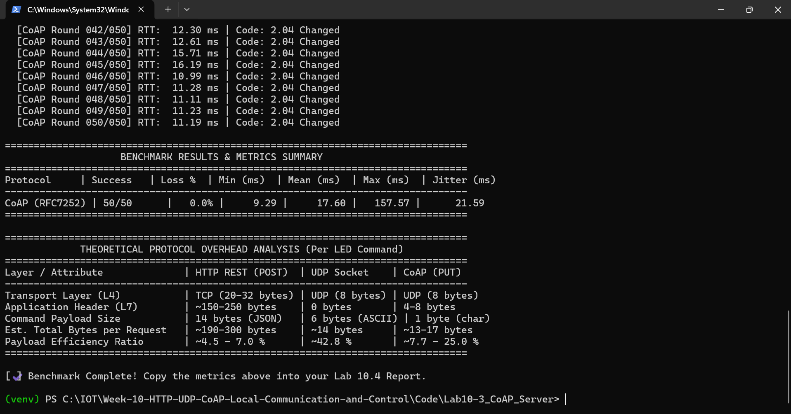
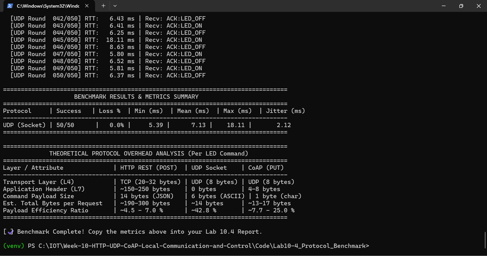
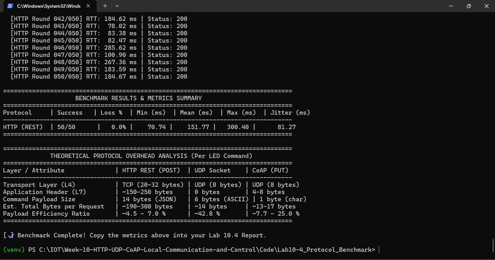
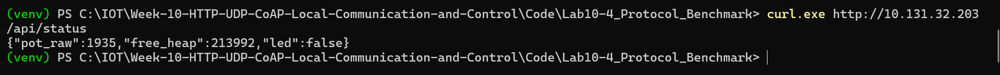

# แบบบันทึกผลการทดลองที่ 10.4
## การทดสอบเปรียบเทียบสมรรถนะโปรโตคอลเครือข่ายและสถิติเชิงวิศวกรรม

> อ้างอิงใบงาน: [09-Labsheet-10-4-Protocol-Benchmark-and-Network-Forensics.md](../09-Labsheet-10-4-Protocol-Benchmark-and-Network-Forensics.md)
> สคริปต์ที่ใช้: `benchmark_protocols.py` / `Code/Lab10-4_Protocol_Benchmark/`

| รายการ | ข้อมูล |
| :--- | :--- |
| ชื่อ–นามสกุล | Theeranat Phutiwanich |
| รหัสนักศึกษา | 67030098 |
| วันที่ทำการทดลอง | 5 ตุลาคม 2569 (2026-10-05) |
| IP Address ของ ESP32 | 10.131.32.203 |
| จำนวนรอบทดสอบต่อโปรโตคอล | 50 |
| เวอร์ชัน Python / `aiocoap` | Python 3.11.15 / aiocoap 0.4.17 |
| สภาพเครือข่ายขณะทดสอบ (SSID, ความแรงสัญญาณ, จำนวนอุปกรณ์ในวง) | SSID `Bismarck .` (WPA2-PSK, ช่อง 1, 802.11 bgn), RSSI ประมาณ -43 ถึง -64 dBm, subnet 10.131.32.0/24, gateway 10.131.32.65 |



---

## ส่วนที่ 1 กิจกรรมที่ 10-4.1 — การวิเคราะห์สัดส่วนข้อมูลตามมาตรฐาน RFC

### ตารางบันทึกการคำนวณสัดส่วนประสิทธิภาพข้อมูล (Payload Efficiency)

$$\text{Payload Efficiency Ratio} = \frac{\text{Payload Size (Bytes)}}{\text{Total Transmitted Bytes}} \times 100\%$$

| รายการประเมิน | HTTP REST (POST) | UDP Datagram | CoAP (PUT) |
| :--- | :---: | :---: | :---: |
| ชั้นสื่อสาร L4 Transport | TCP | UDP | UDP |
| ขนาด L4 Header (ไบต์) | 20–32 | 8 | 8 |
| ขนาด L7 Application Header (ไบต์) | ~180–250 | 0 | 4 |
| ขนาดข้อมูลจริง (Payload) | 14 (`{"state":true}`) | 6 (`LED_ON`) | 1 (`1`) |
| ขนาดข้อมูลรวม (L4 + L7 + Payload) | ~214–296 | 14 | 13 |
| สัดส่วน Payload ต่อข้อมูลรวม (%) | ~4.7 – 6.5 % | ~42.9 % | ~7.7 % |
| ปริมาณข้อมูลเมื่อส่ง 10,000 ครั้ง | ~2.1 – 3.0 MB | ~140 KB | ~130 KB |

**แสดงวิธีการคำนวณ**
```text
(ไม่นับ IP Header 20 ไบต์ ซึ่งเท่ากันทุกโปรโตคอล ตามที่ใบงานกำหนด)

HTTP REST (POST):
  ขนาดรวมต่ำสุด  = TCP 20 + HTTP header 180 + payload 14 = 214 ไบต์
  ขนาดรวมสูงสุด = TCP 32 + HTTP header 250 + payload 14 = 296 ไบต์
  Efficiency     = 14 / 214 x 100 = 6.5 %    ถึง    14 / 296 x 100 = 4.7 %
  ส่ง 10,000 ครั้ง = 214 x 10,000 = 2,140,000 ไบต์ (~2.1 MB)
                     ถึง 296 x 10,000 = 2,960,000 ไบต์ (~3.0 MB)

UDP Datagram:
  ขนาดรวม       = UDP 8 + L7 header 0 + payload 6 ("LED_ON") = 14 ไบต์
  Efficiency     = 6 / 14 x 100 = 42.9 %
  ส่ง 10,000 ครั้ง = 14 x 10,000 = 140,000 ไบต์ (~140 KB)

CoAP (PUT):
  ขนาดรวม       = UDP 8 + CoAP header 4 + payload 1 ("1") = 13 ไบต์
  Efficiency     = 1 / 13 x 100 = 7.7 %
  ส่ง 10,000 ครั้ง = 13 x 10,000 = 130,000 ไบต์ (~130 KB)

เทียบ HTTP กับ CoAP (ขนาดต่อคำสั่ง): 214 / 13 = ~16.5 เท่า  (ตรงกับช่วง 15-20 เท่าในใบงาน)
```

**หมายเหตุ:** CoAP มีสัดส่วน Payload ต่ำ (7.7 %) เพราะ payload แค่ 1 ไบต์ แต่ขนาดรวมต่อคำสั่งใกล้เคียง UDP (13 เทียบ 14 ไบต์) และยังได้ฟีเจอร์เพิ่ม เช่น Message ID, ACK, URI path ส่วน UDP ดิบมีสัดส่วนสูงสุดเพราะไม่มี header ชั้น Application เลย

---

## ส่วนที่ 2 กิจกรรมที่ 10-4.2 — ผลการทดสอบ RTT ด้วย `benchmark_protocols.py`

### 2.1 ผลลัพธ์ดิบจากสคริปต์ Benchmark

**คำสั่งที่ใช้รัน**
```bash
python benchmark_protocols.py --target 10.131.32.203 --protocol http --rounds 50
python benchmark_protocols.py --target 10.131.32.203 --protocol coap --rounds 50
python benchmark_protocols.py --target 10.131.32.203 --protocol udp --rounds 50
```

**ผลลัพธ์ที่ได้** *(วางตาราง Comparison Matrix ที่สคริปต์พิมพ์ออกมา)*
```text
(รวมผลสรุปจากการรันแยกทีละโปรโตคอล เพราะต้อง flash เฟิร์มแวร์ของแต่ละแล็บบนบอร์ดเดียวกัน)
Protocol       | Success | Loss %  | Min (ms) | Mean (ms) | Max (ms) | Jitter (ms)
--------------------------------------------------------------------------------
HTTP (REST)    | 50/50   |   0.0%  |    70.74 |    151.77 |   300.40 |       81.27
UDP (Socket)   | 50/50   |   0.0%  |     5.39 |      7.13 |    18.11 |        2.12
CoAP (RFC7252) | 50/50   |   0.0%  |     9.29 |     17.60 |   157.57 |       21.59
```







### 2.2 ตารางบันทึกผลการทดสอบ RTT จริง (หน่วย: มิลลิวินาที ms)

| โปรโตคอล | จำนวนรอบที่สำเร็จ | Packet Loss (%) | Min RTT (ms) | Mean RTT (ms) | Max RTT (ms) | Jitter / StdDev (ms) |
| :--- | :---: | :---: | :---: | :---: | :---: | :---: |
| **HTTP REST (`/api/led`)** | 50 / 50 | 0.0 | 70.74 | 151.77 | 300.40 | 81.27 |
| **UDP Socket (พอร์ต 3333)** | 50 / 50 | 0.0 | 5.39 | 7.13 | 18.11 | 2.12 |
| **CoAP PUT (`/actuator/led`)** | 50 / 50 | 0.0 | 9.29 | 17.60 | 157.57 | 21.59 |

**ข้อสังเกตจากผลการทดสอบ**
```text
1) ทั้ง 3 โปรโตคอลส่งสำเร็จ 50/50 รอบ (Packet Loss 0 %) ในเครือข่าย Wi-Fi เดียวกัน
2) ความหน่วงเฉลี่ย (Mean RTT): UDP 7.13 ms < CoAP 17.60 ms < HTTP 151.77 ms
   HTTP ช้ากว่า UDP ~21 เท่า และช้ากว่า CoAP ~8.6 เท่า เพราะสคริปต์เปิด TCP connection
   ใหม่ทุกคำขอ (3-way handshake) และต้องส่ง HTTP header ขนาดใหญ่
3) Jitter: UDP 2.12 ms นิ่งที่สุด, CoAP 21.59 ms, HTTP 81.27 ms (สูงกว่า UDP ~38 เท่า)
4) CoAP มี Max RTT 157.57 ms (รอบที่ 27) เป็น outlier เดี่ยว น่าจะมาจาก Wi-Fi power-save
   (log แสดง "pm start") ทำให้ Mean และ Jitter สูงขึ้น ส่วนรอบอื่นอยู่ราว 10-18 ms
5) รอบแรกของ CoAP ช้า (68.05 ms) จากการตั้งค่า socket / ARP ครั้งแรก
6) UDP ทดสอบซ้ำ 2 รอบได้ผลสอดคล้องกัน (Mean 7.63 และ 7.13 ms)
```

---

## ส่วนที่ 3 กิจกรรมที่ 10-4.3 — การตรวจสอบหน่วยความจำบน ESP32 (RAM Footprint)

ตรวจสอบค่า `free_heap` จาก `idf.py monitor` หรือจาก HTTP JSON Response (`/api/status`)

ค่าทั้งหมดวัดจาก `[HEAP]` ใน Serial Monitor (ESP-IDF v6.1) ซึ่งเพิ่มโค้ดพิมพ์ `esp_get_free_heap_size()` ทั้งก่อนเริ่มเซิร์ฟเวอร์ (Baseline) และหลังเซิร์ฟเวอร์ทำงาน 2 วินาที (ยังไม่มี client เชื่อมต่อ) เนื่องจากแต่ละเฟิร์มแวร์เป็นโปรแกรมแยกกัน Baseline จึงต่างกันเล็กน้อย

| สถานะการทำงานของ ESP32 | Free Heap ที่วัดได้ (ไบต์) | แรมที่ใช้ไปโดยประมาณ (KB) | ค่าอ้างอิงในใบงาน |
| :--- | :---: | :---: | :---: |
| Baseline หลังต่อ Wi-Fi สำเร็จ (ก่อนรันเซิร์ฟเวอร์) | UDP 225,388 / HTTP 217,764 / CoAP 212,428 | อ้างอิง (0 KB) | ~240–260 KB |
| HTTP REST Server (`esp_http_server`) | 209,968 (~205 KB) | 7,796 ไบต์ (~7.6 KB) | ~210–225 KB (ใช้ ~25–40 KB) |
| UDP Socket Server (LwIP Raw Socket) | 215,936 (~211 KB) | 9,452 ไบต์ (~9.2 KB) | ~235–250 KB (ใช้ ~5–10 KB) |
| CoAP Server (`espressif/coap` / `libcoap`) | 201,944 (~197 KB) | 10,484 ไบต์ (~10.2 KB) | ~190–215 KB (ใช้ ~35–50 KB) |



**เปรียบเทียบค่าที่วัดได้กับค่าอ้างอิง และอธิบายสาเหตุหากคลาดเคลื่อน**
```text
1) Baseline ที่วัดได้ (212-225 KB) ต่ำกว่าค่าอ้างอิง (240-260 KB) เพราะใช้ ESP-IDF v6.1 และ
   ตั้งค่า Wi-Fi/LwIP ตามค่าเริ่มต้นของเวอร์ชันนี้ นอกจากนี้ Baseline ของแต่ละเฟิร์มแวร์ไม่เท่ากัน
   (UDP > HTTP > CoAP) เพราะโค้ดที่ลิงก์เข้ามาใหญ่ต่างกัน (CoAP มี libcoap/mbedTLS, HTTP มี mDNS
   และ http server) ซึ่งกินแรมตั้งแต่ตอนบูต

2) แรมที่เซิร์ฟเวอร์ใช้เพิ่ม: UDP 9.2 KB, CoAP 10.2 KB, HTTP 7.6 KB ค่า UDP อยู่ในช่วงอ้างอิง
   (5-10 KB) ส่วน HTTP และ CoAP ต่ำกว่าค่าอ้างอิง (25-40 และ 35-50 KB) มาก เพราะ
   - วัดตอนยังไม่มี client เชื่อมต่อ จึงยังไม่มี buffer ต่อ connection ของ HTTP (ต้อง parse
     request/ส่ง response) หรือ session/PDU state ของ CoAP
   - ส่วนหนึ่งของต้นทุนที่ใบงานนับ (โค้ดและ static data ของไลบรารี) ถูกนับรวมใน Baseline
     ไปแล้ว เพราะอยู่ในอิมเมจที่โหลดตั้งแต่บูต
   - UDP ใช้มากกว่าที่คาดเล็กน้อยจากการสร้าง 2 task (stack 4 KB x 2)

3) เมื่อเทียบ "แรมคงเหลือสุดท้าย" ซึ่งสะท้อนต้นทุนรวมต่อโปรโตคอลได้ตรงกว่า:
   UDP 215,936 > HTTP 209,968 > CoAP 201,944 ไบต์ สรุปได้ว่า UDP ประหยัดแรมที่สุด และ CoAP ใช้
   มากที่สุด ตามแนวโน้มที่ใบงานอธิบาย (UDP เป็นเพียง socket ธรรมดา ส่วน CoAP ต้องมี
   libcoap context, resource tree และ stack 8 KB) แม้ส่วนต่างจะน้อยกว่าที่ใบงานประมาณไว้

4) ค่า free_heap = 213,992 จาก curl /api/status วัดคนละรอบบูตและก่อนเพิ่มโค้ดวัดใน log จึงต่างจาก
   209,968 ราว 4 KB (ค่าแรมเปลี่ยนตามจังหวะและขนาดเฟิร์มแวร์) ใช้ค่าจาก log เป็นค่าหลักเพื่อให้
   เงื่อนไขการวัดของทั้ง 3 โปรโตคอลเหมือนกัน
```

---

## ส่วนที่ 4 วิเคราะห์ผลและสรุปบทเรียนเชิงวิศวกรรม

### 4.1 เปรียบเทียบจุดเด่นและจุดด้อย (Pros & Cons Matrix)

**จงสรุปข้อดีและข้อจำกัดของ HTTP, UDP และ CoAP จากผลการทดลองจริง**

| โปรโตคอล | จุดเด่น (Pros) | จุดด้อย (Cons) |
| :--- | :--- | :--- |
| **HTTP REST** | ใช้งานง่าย เป็นมาตรฐานที่ทุกแพลตฟอร์มรองรับ (เบราว์เซอร์, curl) อ่านข้อมูล JSON ได้ทันที มีความน่าเชื่อถือจาก TCP | ช้าที่สุด (Mean 151.77 ms) Jitter สูง (81.27 ms) ภาระ header ~214-296 ไบต์ต่อคำสั่ง (Efficiency ~5-6 %) ใช้แรมมาก (free_heap เหลือ ~209 KB) |
| **UDP Socket** | เร็วและนิ่งที่สุด (Mean 7.13 ms, Jitter 2.12 ms) overhead ต่ำสุด (14 ไบต์, Efficiency ~42.9 %) ใช้แรมน้อย | ไม่มีกลไกรับประกันการส่ง ไม่มีลำดับ และไม่มีมาตรฐานรูปแบบข้อความ ต้องออกแบบ ACK/retry เอง ไม่มีความปลอดภัยในตัว |
| **CoAP** | Header เล็ก 4 ไบต์ (รวม 13 ไบต์) มีโมเดล REST (GET/PUT, URI) และ ACK ในตัว เหมาะกับอุปกรณ์จำกัดทรัพยากร | ช้ากว่า UDP ~2.5 เท่า (Mean 17.60 ms) ต้องใช้ไลบรารี libcoap (ใช้แรมและโค้ดเพิ่ม) เบราว์เซอร์ใช้ตรงไม่ได้ |

**สรุปเชิงบรรยาย**

* **HTTP**
```text
HTTP ให้ความสะดวกสูงสุดในการพัฒนาและเชื่อมต่อกับเว็บ แต่จากการวัดจริงมี RTT เฉลี่ย
151.77 ms และ Jitter 81.27 ms สูงกว่าโปรโตคอลอื่นมาก เนื่องจากต้องสร้าง TCP connection
และส่ง header แบบข้อความขนาดใหญ่ทุกครั้ง จึงไม่เหมาะกับงานที่ต้องการความเร็วหรือประหยัด
พลังงาน/แบนด์วิดท์ แต่เหมาะกับงานที่ผู้ใช้โต้ตอบผ่านเว็บ
```

* **UDP**
```text
UDP ให้สมรรถนะดีที่สุดในการทดลอง (Mean 7.13 ms, Jitter 2.12 ms, Efficiency ~42.9 %)
เพราะไม่มี handshake และไม่มี header ชั้น Application ข้อจำกัดคือไม่การันตีการส่งถึง
ในการทดลองไม่พบ packet loss เพราะเป็น Wi-Fi วงเดียวกันที่โหลดต่ำ แต่ในระบบจริงต้องเพิ่ม
เลขลำดับและ ACK เอง เหมาะกับข้อมูลที่ต้องการความสดใหม่และความถี่สูง
```

* **CoAP**
```text
CoAP อยู่ตรงกลาง: มี header เพียง 4 ไบต์และยังมีโครงสร้างแบบ REST พร้อม ACK ให้ในตัว
Mean 17.60 ms ซึ่งดีกว่า HTTP ประมาณ 8.6 เท่า แต่ช้ากว่า UDP ดิบ ค่า Jitter 21.59 ms
ได้รับผลจาก outlier เพียงรอบเดียว (157.57 ms) จาก Wi-Fi หากตัด outlier ค่าเฉลี่ยจะอยู่ที่
ราว 13 ms เหมาะกับอุปกรณ์ IoT ที่ใช้แบตเตอรี่และต้องการมาตรฐานที่ควบคุมอุปกรณ์ได้
```

---

### 4.2 กรณีศึกษาการตัดสินใจเลือกใช้โปรโตคอล (Engineering Case Studies)

#### กรณีศึกษาที่ 1
> ระบบเซนเซอร์วัดความชื้นในดินและวาล์วน้ำเพื่อการเกษตรอัจฉริยะ ทำงานด้วยแบตเตอรี่โซลาร์เซลล์ขนาดเล็ก ติดตั้งกลางแจ้งห่างไกล

| รายการ | คำตอบ |
| :--- | :--- |
| **โปรโตคอลที่เลือก** | CoAP |

**เหตุผลทางวิศวกรรม** *(อ้างอิงข้อมูลเชิงปริมาณจากตารางในส่วนที่ 1–3 ประกอบ)*
```text
อุปกรณ์ใช้แบตเตอรี่และอยู่ไกล ต้องลดเวลาเปิดวิทยุและปริมาณข้อมูล CoAP ส่งคำสั่งเพียง 13 ไบต์
เทียบกับ HTTP ราว 214-296 ไบต์ (น้อยกว่า ~16 เท่า) และใช้ UDP ไม่มี handshake แบบ TCP จึง
ใช้พลังงานและค่าข้อมูลเซลลูลาร์น้อยกว่า อีกทั้ง CoAP มี ACK (Confirmable) ช่วยยืนยันว่าคำสั่ง
เปิด/ปิดวาล์วถึงจริง ซึ่งสำคัญกว่าการใช้ UDP ดิบที่ไม่มีการรับประกัน และเป็นมาตรฐาน RFC 7252
ที่ออกแบบสำหรับอุปกรณ์จำกัดทรัพยากรโดยตรง
```

---

#### กรณีศึกษาที่ 2
> เว็บแดชบอร์ดสำหรับฝ่ายซ่อมบำรุงในโรงงาน เพื่อเปิดดูสถานะและตั้งค่าพารามิเตอร์ของอุปกรณ์ผ่านเว็บบราวเซอร์บนแท็บเล็ต/สมาร์ตโฟน

| รายการ | คำตอบ |
| :--- | :--- |
| **โปรโตคอลที่เลือก** | HTTP REST |

**เหตุผลทางวิศวกรรม**
```text
เบราว์เซอร์สื่อสารด้วย HTTP โดยตรง (fetch/XHR) โดยไม่ต้องติดตั้งแอปหรือไลบรารีเพิ่ม และ JSON
อ่านง่ายสำหรับแสดงผลบนหน้าเว็บ งานนี้เป็นการโต้ตอบโดยคน ความหน่วง ~150 ms ที่วัดได้ยัง
ไม่ส่งผลต่อประสบการณ์ใช้งาน และเครื่องมือสนับสนุน (ดีบัก, cURL, การยืนยันตัวตน, HTTPS)
พร้อมใช้งาน จึงคุ้มกับ overhead ที่สูงกว่า ซึ่งไม่ใช่ปัญหาเพราะอุปกรณ์ใช้ไฟและอยู่ใน LAN
```

---

#### กรณีศึกษาที่ 3
> ระบบควบคุมแขนกลอุตสาหกรรมความเร็วสูง ที่ต้องการส่งพิกัดตำแหน่งแกนหมุน (X, Y, Z) ด้วยความถี่ 100 ครั้งต่อวินาที (100 Hz) ภายในเครือข่าย LAN ปิด (intranet)

| รายการ | คำตอบ |
| :--- | :--- |
| **โปรโตคอลที่เลือก** | UDP Socket |

**เหตุผลทางวิศวกรรม**
```text
ที่ 100 Hz มีคาบเวลา 10 ms ต่อคำสั่ง HTTP (Mean 151.77 ms) ช้าเกินคาบหลายเท่า และ CoAP
(Mean 17.60 ms, Max 157.57 ms) ก็ยังเกินคาบ ส่วน UDP มี RTT เฉลี่ย 7.13 ms และ Jitter ต่ำสุด
2.12 ms ใกล้เคียงกับที่ต้องการที่สุด ข้อมูลตำแหน่งเป็นแบบ "ค่าล่าสุดสำคัญที่สุด" หากแพ็กเก็ตหายไป
1 ชุด ชุดถัดไปใน 10 ms ก็มาแทนได้ และไม่ควรหน่วงรอส่งซ้ำ การใช้ใน LAN ปิดทำให้ loss ต่ำและไม่ต้อง
กังวลเรื่องแบนด์วิดท์ ควรเพิ่มเลขลำดับในข้อความเพื่อตรวจจับแพ็กเก็ตหายหรือสลับลำดับ
```

---

## ส่วนที่ 5 สรุปผลการทดลองภาพรวมทั้งสัปดาห์

```text
การทดลองสัปดาห์ที่ 10 ได้พัฒนาระบบควบคุม ESP32 ผ่านเครือข่ายท้องถิ่น 3 รูปแบบ คือ HTTP REST
(Lab 10-1), UDP Socket (Lab 10-2) และ CoAP (Lab 10-3) แล้วนำมาวัดเปรียบเทียบใน Lab 10-4 ด้วย
benchmark_protocols.py ทดสอบโปรโตคอลละ 50 รอบ ผ่านครบทุกรอบ (Packet Loss 0 %)

ผลการวัด Mean RTT: UDP 7.13 ms, CoAP 17.60 ms, HTTP 151.77 ms และ Jitter: 2.12, 21.59 และ
81.27 ms ตามลำดับ ซึ่งสอดคล้องกับการวิเคราะห์ overhead: HTTP ต้องใช้ ~214-296 ไบต์ต่อคำสั่ง
(Efficiency ~5-6 %) ขณะที่ UDP ใช้ 14 ไบต์ (~42.9 %) และ CoAP ใช้ 13 ไบต์ (~7.7 %)
จึงสรุปได้ว่าภาระ header และการจัดการ connection มีผลโดยตรงต่อความหน่วงและความนิ่ง

บทเรียนเชิงวิศวกรรมคือไม่มีโปรโตคอลที่ดีที่สุดเพียงตัวเดียว ต้องเลือกตามงาน: HTTP เมื่อต้องเชื่อมกับ
เว็บเบราว์เซอร์, CoAP เมื่ออุปกรณ์จำกัดพลังงานและต้องการ REST ที่เบา, UDP เมื่อต้องการความเร็วและ
ความถี่สูงใน LAN ที่ควบคุมได้ นอกจากนี้ผลวัดบน Wi-Fi มีความแปรปรวนจาก outlier (เช่น CoAP รอบที่ 27)
จึงควรรายงานทั้งค่าเฉลี่ย ค่าสูงสุด และ Jitter ร่วมกัน

ข้อจำกัดของการทดลอง: วัดบน Wi-Fi วงเดียว โปรโตคอลละ 50 รอบ, HTTP วัดแบบเปิด connection ใหม่
ทุกคำขอ (หากใช้ keep-alive จริงอาจเร็วขึ้น) และยังไม่ได้วัด free_heap ของ UDP และ CoAP จึงยังเปรียบเทียบ
RAM Footprint ครบทั้งสามไม่ได้
```
