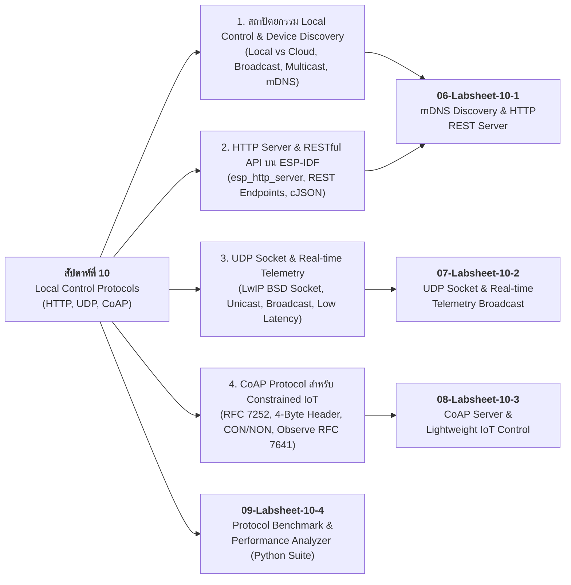

# Week 10: Local Control Protocols (HTTP, UDP, CoAP) & Edge Device Discovery

## 1. บทนำ (Introduction)
ในสัปดาห์ที่ 9 เราได้เรียนรู้การควบคุมอุปกรณ์และแสดงผลระดับลึกผ่านจอภาพ SPI OLED (SSD1306) พร้อมการเชื่อมโยงระบบวงปิด (Closed-loop IoT) แบบ Serial และ Edge Web UI

ในสัปดาห์ที่ 10 นี้ เราจะก้าวเข้าสู่การสื่อสารระดับเครือข่ายท้องถิ่น (**Local Communication & Control**) สำหรับอุปกรณ์ IoT โดยอ้างอิงเนื้อหาจากหนังสือ **ESP32-C3 Wireless Adventure: A Comprehensive Guide to IoT (Chapter 8: Local Control)** ซึ่งเป็นมาตรฐานการพัฒนาด้วยเฟรมเวิร์ก **ESP-IDF (C / FreeRTOS)**

หัวใจสำคัญของ **Local Control** คือ **"การควบคุมอุปกรณ์ได้อย่างรวดเร็ว มีความหน่วงต่ำ (Low Latency) และยังคงทำงานได้แม้ไม่มีอินเทอร์เน็ต (No Cloud Dependency)"** ผ่านเครือข่าย Wi-Fi ท้องถิ่น (Local Area Network - LAN) โดยในสัปดาห์นี้นักศึกษาจะได้เจาะลึก 3 โปรโตคอลหลัก:

1. **HTTP (HyperText Transfer Protocol)**: โปรโตคอลระดับแอปพลิเคชันบน TCP ที่นิยมที่สุด รองรับสถาปัตยกรรม RESTful API และแลกเปลี่ยนข้อมูลด้วย JSON Payload
2. **UDP (User Datagram Protocol)**: โปรโตคอลระดับ Transport แบบ Connectionless ความเร็วสูง เหมาะสำหรับการบรอดแคสต์ค้นหาอุปกรณ์ (Device Discovery) และการส่งข้อมูล Real-time Telemetry
3. **CoAP (Constrained Application Protocol - RFC 7252)**: โปรโตคอล REST-like บน UDP ที่ออกแบบมาเพื่ออุปกรณ์สมองกลฝังตัวและระบบเครือข่ายพลังงานต่ำโดยเฉพาะ มีขนาด Packet Header เพียง 4 ไบต์ และรองรับการติดตามข้อมูลแบบ Observe (Publish/Subscribe)

นอกจากนี้ เราจะได้ศึกษาและประยุกต์ใช้โปรโตคอล **mDNS (Multicast DNS)** เพื่อให้คอมพิวเตอร์และสมาร์ตโฟนสามารถค้นหาอุปกรณ์ ESP32 ในวงแลนได้อัตโนมัติ โดยไม่ต้องจดจำหมายเลข IP Address (Zero-Configuration Networking)


* หนังสืออ้างอิงที่กล่าวถึงในบทนี้คือ  [Chapter 8](https://github.com/espressif/esp32-c3-book-en/tree/main/src/chapter_8) ของ  _**ESP32-C3 Wireless Adventure A Comprehensive Guide to IoT**_  แต่งโดย **Espressif Systems**  

**Repo ของหนังสือ**  https://github.com/espressif/esp32-c3-book-en/

---

## 2. แผนผังเนื้อหาการเรียนรู้ประจำสัปดาห์ (Lesson Roadmap)



---

## 3. ตารางเปรียบเทียบคุณสมบัติ 3 โปรโตคอลหลัก (Protocol Comparison Matrix)

| คุณสมบัติ | HTTP (REST API) | UDP Socket | CoAP (RFC 7252) |
| :--- | :--- | :--- | :--- |
| **Transport Layer** | TCP (Connection-oriented) | UDP (Connectionless) | UDP (Connectionless) |
| **Header Overhead** | ใหญ่ (> 100 ไบต์ สำหรับ Text Header) | เล็กมาก (8 ไบต์) | กะทัดรัด (4 ไบต์ + Options) |
| **ความน่าเชื่อถือ (Reliability)** | สูง (TCP ACK / Retransmission) | ไม่รับประกัน (Best-effort) | เลือกได้ (Confirmable: CON / Non-confirmable: NON) |
| **รูปแบบการสื่อสาร** | Request / Response | Send / Receive (Datagram) | Request / Response และ Observe (Pub/Sub) |
| **การค้นหาอุปกรณ์** | อาศัย mDNS / SSDP เสริม | รองรับ Broadcast / Multicast ในตัว | รองรับ Multicast Discovery (`/.well-known/core`) |
| **ความปลอดภัย** | TLS (HTTPS) | DTLS หรือ Application-level | DTLS (CoAPS) |
| **ความเหมาะสมกับงาน IoT** | Web UI, ระบบจัดการคอนฟิกทั่วไป | ส่งข้อมูลสตรีมมิ่งความถี่สูง, Audio/Video | เซนเซอร์ขนาดเล็ก, อุปกรณ์ใช้แบตเตอรี่ |

---

## 4. ตารางการต่อสายฮาร์ดแวร์ (Hardware Wiring)

การทดลองในสัปดาห์นี้ใช้ฮาร์ดแวร์พื้นฐานเพื่อเป็นตัวแทนของ **Actuator (LED / Relay)** และ **Sensor (Analog Potentiometer)** สำหรับการควบคุมและอ่านค่าผ่านเครือข่าย

| อุปกรณ์ | ขาบนอุปกรณ์ | ขาต่อบน ESP32 | หน้าที่การทำงาน |
| :--- | :--- | :--- | :--- |
| **Onboard / External LED** | ขั้ว Anode (+) / ขาควบคุม | **GPIO 2** | ตัวแทน Actuator สำหรับสั่งเปิด-ปิด (ON/OFF) |
| **Potentiometer (10k)** | Pin 2 (Wiper / Output) | **GPIO 34** (ADC1_CH6) | ตัวแทน Sensor สำหรับอ่านค่าอนาล็อกและส่ง Telemetry |
| **Potentiometer (10k)** | Pin 1 (VCC) / Pin 3 (GND) | **3.3V / GND** | แรงดันไฟเลี้ยงและกราวด์อ้างอิง |

```
        ESP32 Board                             Peripherals
      +--------------+                            +------------------+
      |       GPIO 2 |----------------------------| LED (Actuator)   |
      |      GPIO 34 |----------------------------| Potentiometer    |
      |         3.3V |----------------------------| VCC (3.3V)       |
      |          GND |----------------------------| GND              |
      +--------------+                            +------------------+
```

---

## 5. รายการเอกสารบทเรียนและใบงานประจำสัปดาห์

1. **[01-Local-Control-Architecture-and-Discovery.md](01-Local-Control-Architecture-and-Discovery.md)** - สถาปัตยกรรมการควบคุมภายในเครือข่ายท้องถิ่น, การทำงานแบบ Broadcast/Multicast และกลไก Multicast DNS (mDNS)
2. **[02-HTTP-Server-and-RESTful-API-on-ESP-IDF.md](02-HTTP-Server-and-RESTful-API-on-ESP-IDF.md)** - การพัฒนาระบบเว็บเซิร์ฟเวอร์ด้วย `esp_http_server`, การออกแบบ RESTful API Endpoints และการจัดการ JSON ด้วย cJSON
3. **[03-UDP-Socket-Communication-and-Realtime-Telemetry.md](03-UDP-Socket-Communication-and-Realtime-Telemetry.md)** - การเขียนโปรแกรม Socket ระดับล่างด้วย LwIP BSD Socket, การส่งข้อมูล Real-time Telemetry และการ Broadcast ค้นหาอุปกรณ์
4. **[04-CoAP-Protocol-for-Constrained-IoT.md](04-CoAP-Protocol-for-Constrained-IoT.md)** - โปรโตคอล CoAP (RFC 7252), โครงสร้าง Message Header 4 ไบต์, คอนเซปต์ Request/Response, CON/NON และการทำงานแบบ Observe
5. **[05-Glossary.md](05-Glossary.md)** - อภิธานศัพท์และคำย่อทางเทคนิคประจำสัปดาห์ที่ 10
6. **[06-Labsheet-10-1-mDNS-Discovery-and-HTTP-REST-Server.md](06-Labsheet-10-1-mDNS-Discovery-and-HTTP-REST-Server.md)** - **ใบงานที่ 10.1: การพัฒนา mDNS Discovery และ HTTP RESTful API Server ควบคุมอุปกรณ์บน ESP-IDF**
7. **[07-Labsheet-10-2-UDP-Broadcast-and-Realtime-Telemetry.md](07-Labsheet-10-2-UDP-Broadcast-and-Realtime-Telemetry.md)** - **ใบงานที่ 10.2: การสื่อสารความหน่วงต่ำด้วย UDP Socket และการถ่ายทอดข้อมูล Real-time Telemetry**
8. **[08-Labsheet-10-3-CoAP-Server-and-Lightweight-IoT-Control.md](08-Labsheet-10-3-CoAP-Server-and-Lightweight-IoT-Control.md)** - **ใบงานที่ 10.3: การพัฒนา CoAP Server สำหรับระบบฝังตัวและการควบคุมอุปกรณ์ด้วยโปรโตคอลน้ำหนักเบา**
9. **[09-Labsheet-10-4-Protocol-Benchmark-and-Network-Forensics.md](09-Labsheet-10-4-Protocol-Benchmark-and-Network-Forensics.md)** - **ใบงานที่ 10.4: การทดสอบเปรียบเทียบสมรรถนะ (Benchmark) ของโปรโตคอลเครือข่ายด้วย Python Script และสถิติเชิงวิศวกรรม**

---

## 6. เครื่องมือและอุปกรณ์ที่จำเป็น (Prerequisites)

* บอร์ดไมโครคอนโทรลเลอร์ **ESP32** (Classic ESP32 หรือ ESP32-C3) จำนวน 1 บอร์ด
* โมดูลหลอดไฟ LED หรือตัวต้านทานปรับค่าได้ (Potentiometer) 10k
* เครื่องคอมพิวเตอร์ที่ติดตั้ง **ESP-IDF v5.x / v6.x** และสภาวะแวดล้อม **Python 3.10+**
* เครื่องมือทดสอบเครือข่าย: **cURL**, สคริปต์ **Benchmark Suite (`benchmark_protocols.py`)**, และ Python Libraries (`aiocoap`)
* เราเตอร์ Wi-Fi (Wi-Fi Access Point 2.4 GHz) ในวงแลนเดียวกัน

